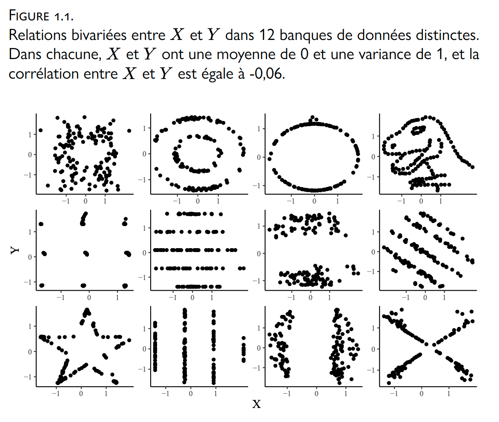
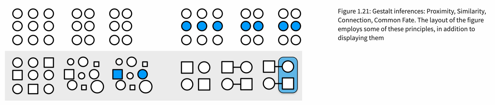

```{r setup, include=FALSE}
options(knitr.duplicate.label = "allow")

knitr::opts_chunk$set(echo = TRUE, collapse = TRUE, prompt = TRUE, tidy = FALSE, out.width = '60%', fig.align = "center", warning = FALSE)
```

La visualisation des données sert de multiples objectifs, comme rendre cohérente une masse importante de données, découvrir des tendances, vulgariser des résultats scientifiques complexes, diagnostiquer des problèmes dans un ensemble de données (des valeurs aberrantes ou influentes, des relations non-linéaires) ou découvrir des erreurs de codage. Dans cet atelier, nous survolerons quelques principes généraux de la visualisation des données, puis apprendrons les rudiments de la fonction `ggplot()` du langage R, qui permet de créer différents types de graphiques. Nous terminerons avec un survol de techniques pour visualiser les résultats de régression avec `ggplot()`.

<center>

{width=500px}

</center>

# Quelques principes généraux de la visualisation des données

Dans son [ouvrage](https://socviz.co/index.html#preface) (2018) sur la visualisation des données, Kieran Healy souligne que notre cerveau peut nous jouer des tours quand on regarde des graphiques. L’oeil humain ne voit pas toutes les formes, couleurs et contrastes aussi efficacement les uns que les autres. Les recherches ont démontré que l’humain distingue mieux les différences de tailles quand elles sont organisées sous forme de lignes, plutôt que sous forme d’aires, d’angles ou de cercles. 

Cela ne veut pas dire qu'il faut à tout prix éviter les aires ou les angles quand on dessine un graphique. Or, il faut réfléchir aux éléments qu'on décide d'intégrer dans nos graphiques. Healy (voir aussi [Arel-Bundock, 2020](http://arelbundock.com/acmq.html)) soulève certaines tendances de la cognition dont il faut être particulièrement conscients:

- l’oeil relie les éléments visuels qui se ressemblent; ("similarity")
- l'oeil relie les éléments qui sont proche les uns des autres; ("proximity")
- les éléments incomplets sont complétés par notre cerveau; ("closure", "continuity")
- le cerveau conclut qu'il existe une relation entre les éléments qui sont liés ensemble par l'image; ("connection", voir aussi "common fate")
- certains motifs peuvent créer des illusions d’optique;
- l’oeil détecte mieux les contrastes dans les images monochromes (en noir et blanc) que colorées; 
- quand le nombre de couleurs augmente, il devient plus difficile de distinguer les informations, surtout si c’est combiné avec des formes variées.

<center>

{width=800px}

</center>

Un des plus grands du domaine de la visualisation des données, Edward Tufte, souligne quatre principes fondamentaux de la visualisation:

1) __Intégrité__: Ne pas être malhonnête avec les données, montrer les données telles qu'elles le sont, avant toute transformation.
2) __Simplicité__: Réduire la quantité d’encre pour la quantité d’information transmise -- éliminer les décorations, diminuer le nombre de dimensions.
3) __Contexte__: Ajouter un titre, identifier les axes, identifier les variables et les garder sur des échelles standardisées, ajouter une légende qui décrit bien les élements du graphique.
4) __Esthétique__: Ultimement, il faut que ce soit beau. Et la beauté est subjective.

# Comment choisir le bon type de graphique?

Il n'y a pas de règles strictes pour choisir le bon type de graphique. Or, il est utile d'entamer sa démarche en se posant les questions suivantes: Qui est l’audience de notre graphique/de notre article scientifique? Quelle histoire voulons-nous raconter? Quelle est la nature de nos données? Sur quoi avons-nous l'intention de mettre l'emphase? Quel message voulons-nous transmettre à l'aide de notre graphique? Un tableau serait-il plus approprié pour transmettre l'information?

Ensuite, il est possible de suivre certains guides, comme celui de [Data-to-Viz](https://www.data-to-viz.com/), pour nous aider à choisir un bon graphique pour le type et la quantité de variables à visualiser. Mais au final, nos goûts sont aussi importants. Le plus important, comme le dit Tufte, est de ne pas faire mentir les données et de ne pas tenter de transmettre trop d'informations à la fois. Un graphique devrait être intuitif et explicite.

# Visualisation dans R

## Préparation

__Avant d'aller plus loin: Tout au long de l'atelier, j'exécuterai les lignes de codes inscrites ici. Pour maximiser votre apprentissage, je vous recommande de suivre en écrivant vous aussi les lignes de codes dans un script R vide, puis d'exécuter les lignes une à une.__

Dans ces notes, vous apprendrez les rudiments de `ggplot()`, une fonction très flexible de visualisation de données. `ggplot()` se trouve dans la bibliothèque `ggplot2`, qui ne vient pas par défaut dans `R`. Il faut donc l'installer. Nous utiliserons également les bibliothèques `tidyverse` et `broom`.

```{r, eval=T,message=F}
# install.packages("ggplot2") # pas besoin de l'installer à nouveau si c'est déjà fait 
# install.packages("tidyverse")  # pas besoin de l'installer à nouveau si c'est déjà fait 
# install.packages("broom") # pas besoin de l'installer à nouveau si c'est déjà fait 
library(ggplot2) 
library(tidyverse)
library(broom)
```

_Les bibliothèques ont besoin d'être installées une seule fois_. Il est par contre nécessaire de "lire" les bibliothèques à chaque nouvelle ouverture du projet. On lit une bibliothèque à l'aide de `library()`.

Avant d'aller plus loin, il faut importer les banques de données dans notre environnement. Pour les démonstrations qui suivront, nous utiliserons la banque de données `airquality`, qui contient des mesures de la qualité de l'air à NY.

```{r}
data()
air <- airquality
```

Les variables suivantes sont contenues dans cette banque de données:

`Ozone`: Mean ozone in parts per billion from 1300 to 1500 hours at Roosevelt Island

`Solar.R`: Solar radiation in Langleys in the frequency band 4000–7700 Angstroms from 0800 to 1200 hours at Central Park

`Wind`: Average wind speed in miles per hour at 0700 and 1000 hours at LaGuardia Airport

`Temp`: Maximum daily temperature in degrees Fahrenheit at La Guardia Airport

`Day`: Day, 1-31

`Month`: Month, 1-12

## La fonction `ggplot()`

```{r, tidy=FALSE}
?ggplot
```

La fonction `ggplot()` permet de transformer des données à une représentation graphique. Elle comprend deux élements obligatoires, `data =` et `mapping = aes()`. 

`ggplot(data = ..., mapping = aes(...))`

1) Dans l'argument `data =`, on spécifie la banque de données d'où proviennent les variables à visualiser.

`ggplot(data = air, mapping = aes(...))`

2) À l'intérieur de la parenthèse de l'argument `mapping = aes()` (pour "aesthetic"), on spécifie les variables qui prendront place sur l'axe des X et des Y. On peut aussi y spécifier la manière dont seront regroupées les données, dans le cas de données groupées.

`ggplot(data = air, mapping = aes(x = Wind, y = Temp))`

Ici, la variable `Wind` se trouvera sur l'axe des X et la variable `Temp` se trouvera sur l'axe des Y. Ces variables sont dans la banque de données `air`, que nous avons enregistrée dans notre ennvironnement R plus tôt.

### Étape 1: lier des données à une représentation graphique

La première étape est donc de spécifier ces éléments dans la fonction `ggplot()`. On enregistre le tout dans un objet appelé `graph`. 

```{r}
graph <- ggplot(data = air, mapping = aes(x = Wind, y = Temp))
```

Si nous affichons l'objet `graph`, `R` fera apparaître un graphique complètement vide sous l'onglet "Plots". 

```{r}
graph
```

Cela s'explique par le fait que nous avons spécifié les données et les variables, mais nous n'avons toujours pas spécifié quel type de graphique nous voulions à l'intérieur (un nugae de points, un diagramme à bâtons, à ligne, etc.). 

### Étape 2: manipuler le `geom` d'un graphique

C'est pourquoi la deuxième étape est absolument essentielle. Nous ajouterons un type de graphique à notre objet original, à l'aide du symbole `+`. De multiples types de graphiques existent. La plupart commencent par `geom_`, par exemple `geom_point()`, `geom_line()`, `geom_bar()`, `geom_histogram()`, `geom_boxplot()`, etc.

```{r}
graph2 <- ggplot(data = air, mapping = aes(x = Wind, y = Temp)) + 
  geom_point()

graph2 # affichons cet objet
```

Nous avons donc un graphique avec la vitesse du vent sur l'axe des X, et la température sur l'axe des Y.

### Étape 3.1: Manipuler l'`aes`

En plus de spécifier les variables qui se trouvent sur l'axe des X et des Y, l'argument `aes()` sert à préciser d'autres aspects de la représentation visuelle, comme la couleur, la forme, la taille et l'opacité des éléments qui se trouvent dans le graphique. Pour ce faire, on indique quelle autre variable sera responsable de modifier ces aspects. Ici, je veux colorer les points en fonction du mois (variable `Month`) auquel ils correspondent.

```{r}
graph3 <- ggplot(data = air, mapping = aes(x = Wind, y = Temp, color = Month)) +
  geom_point()
  
graph3

# modifier le mois pour que ce soit une variable catégorielle, et non continue
graph3 <- ggplot(data = air, mapping = aes(x = Wind, y = Temp, color = as.factor(Month))) + 
  geom_point()
  
graph3
```

Je pourrais faire de même pour modifier la forme des points.
```{r}
graph4 <- ggplot(data = air, mapping = aes(x = Wind, y = Temp, shape = as.factor(Month))) + 
  geom_point()
  
graph4
```

On peut modifier d'autres aspects, comme le type de lignes (`linetype`), la couleur de remplissage (`fill`), l'opacité (`alpha`), la taille (`size`), etc.

Parenthèse: Ne faites pas comme moi, évitez de nommer vos graphiques _graph1_, _graph2_, _graph3_, etc.

### Étape 3.2: Manipuler l'`aes` dans chaque `geom`

Il est possible d'ajouter plus d'un `geom` à notre graphique. Par exemple, je pourrais ajouter une ligne de régression linéaire à l'aide de `geom_smooth()`. 

```{r, message = FALSE}
graph5 <- ggplot(data = air, mapping = aes(x = Wind, y = Temp)) + 
  geom_point() +
  geom_smooth(method = "lm") # je précise la méthode "régression linéaire"
  
graph5
```

Cette flexibilité est une des forces de `ggplot`, puisque nous pouvons ensuite modifier chaque `geom` individuellement. En fait, les éléments visuels qui se trouvent dans l'`aes` peuvent être déterminés pour le graphique en entier. Dans ce cas, ils se trouvent dans la fonction `ggplot()`, comme nous l'avons fait depuis le début. Mais ils peuvent aussi être associés à un `geom` en particulier. 

Par exemple, je pourrais vouloir garder les couleurs pour les différents mois, mais avoir une seule ligne de régression. Pour ce faire, je spécifierais des `aes` différents pour mon `geom_point` et mon `geom_smooth`.

```{r, message = FALSE}
graph6 <- ggplot(data = air, mapping = aes(x = Wind, y = Temp)) + 
  geom_point(aes(color = as.factor(Month))) +
  geom_smooth(method = "lm")
  
graph6
```

À l'inverse, si je veux garder tous les points noirs mais avoir plusieurs lignes de régression (une pour chaque mois), je peux intégrer l'argument `color` à `geom_smooth`.

```{r, message = FALSE}
graph7 <- ggplot(data = air, mapping = aes(x = Wind, y = Temp)) + 
  geom_point() +
  geom_smooth(aes(color = as.factor(Month)), method = "lm")
  
graph7
```

### Étape 4: Modifier l'apparence du graphique

Comme vous avez pu le constater, quand on travaille avec `ggplot`, on travaille par étage. On ajoute des éléments les uns après les autres à nos graphiques, en prenant soin de séparer chaque étage avec le symbole `+`. Après avoir déterminé nos `geom`, on peut ensuite modifier l'apparence du graphique. Trois des fonctions les plus utiles sont `scale_...`, `labs` et `theme_...`.

`scale_`permet de modifier les éléments qui se trouvent dans l'`aes`. Cela inclut l'axe des X et des Y, mais aussi tout ce qui se rapporte aux couleurs, formes, etc. 

```{r, message = FALSE}
graph8 <- ggplot(data = air, mapping = aes(x = Wind, y = Temp)) + 
  geom_point(aes(color = as.factor(Month))) +
  geom_smooth(method = "lm") +
  scale_color_discrete(name = "Mois",
                       labels = c("Mai", "Juin", "Juillet", "Août", "Septembre")) + # scale_color_continuous si la variable est continue
  scale_x_continuous(breaks = seq(0, 20, by = 2))
  
graph8
```

`labs` permet d'ajouter et de modifier les titres, sous-titres, titres des axes et notes de bas de graphique.

```{r, message = FALSE}
graph9 <- ggplot(data = air, mapping = aes(x = Wind, y = Temp)) + 
  geom_point(aes(color = as.factor(Month))) +
  geom_smooth(method = "lm") +
  scale_color_discrete(name = "Mois",
                       labels = c("Mai", "Juin", "Juillet", "Août", "Septembre")) +
  scale_x_continuous(breaks = seq(0, 20, by = 2)) +
  labs(title = "Température en fonction de la vitesse du vent à NY",
       subtitle = "Données Airquality",
       x = "Vitesse du vent",
       y = "Température",
       caption = "Graphique par F. Vallée-Dubois")
  
graph9
```

`theme_...` permet de choisir un thème prédéfini pour le graphique. On peut aussi modifier manuellement des éléments du graphique dans la fonction `theme()`. (Personnellement, j'aime aussi jouer avec l'opacité des éléments (`alpha`), surtout les points et les intervalles de confiance. J'aimerais aussi que la ligne de régression soit noire, plutôt que bleue.)

```{r, message = FALSE}
graph10 <- ggplot(data = air, mapping = aes(x = Wind, y = Temp)) + 
  geom_point(aes(color = as.factor(Month)), alpha = .7) +
  geom_smooth(method = "lm", alpha = .3, color = "black") +
  scale_color_discrete(name = "Mois",
                       labels = c("Mai", "Juin", "Juillet", "Août", "Septembre")) +
  scale_x_continuous(breaks = seq(0, 20, by = 2)) +
  labs(title = "Température en fonction de la vitesse du vent à NY",
       subtitle = "Données Airquality",
       x = "Vitesse du vent",
       y = "Température",
       caption = "Graphique par F. Vallée-Dubois") +
  theme_minimal()
  
graph10
```

Finalement, on enregistre notre graphique à l'aide de la fonction `ggsave()`, à partir de laquelle on peut spécifier le format (.png, .pdf, etc.) et la taille. Le graphique s'enregistre alors dans notre espace de travail (_working directory_). 

```{r, eval = FALSE}
ggsave(filename = "graphique_atelier.png", plot = graph10, width = 9, height = 6)
```

En résumé, le code complet de notre graphique tient à quelques lignes de codes seulement. Avec `ggplot()`, les possibilité sont presqu'infinies. Vous constaterez à quel point cette fonction est flexible à force de l'utiliser. 

```{r, eval = FALSE}
# lier les variables à la représentation graphique
graphique <- ggplot(data = air, mapping = aes(x = Wind, y = Temp)) + 
# spécifier des types de graphique (2)
  geom_point() + 
  geom_smooth(aes(color = as.factor(Month)), method = "lm") +
# modifier les éléments "color" et "x" à l'aide de scale_
  scale_color_discrete(name = "Mois", 
                       labels = c("Mai", "Juin", "Juillet", "Août", "Septembre")) +
# ajouter des titres et étiquettes à l'aide de labs
  scale_x_continuous(breaks = seq(0, 20, by = 2)) + 
  labs(title = "Température en fonction de la vitesse du vent à NY", 
       subtitle = "Données Airquality",
       x = "Vitesse du vent",
       y = "Température",
       caption = "Graphique par F. Vallée-Dubois") +
# spécifier un thème
  theme_minimal() 
```

# Comment visualiser des résultats de régression

Supposons que nous sommes intéressés par le modèle suivant:

```{r}
modele <- lm(Temp ~ Wind + Solar.R + as.factor(Month), data = air)
summary(modele)
```

La fonction `summary()` nous montre les résultats de régression sous forme de tableau, avec des colonnes pour les coefficients, les erreurs type, les valeurs t et les statistiques p. Ceci dit, l'objet `modele` n'est pas organisé de cette façon. Si on clique sur l'objet pour le faire apparaître dans un onglet de R Studio, on remarque qu'il ne prend pas la forme d'un tableau. Pour l'organiser sous forme de tableau (comme avec `summary`), nous aurons recours à la fonction `tidy()`. Nous voulons non seulement avoir accès aux erreurs type et statistiques p, mais aussi aux intervalles de confiance. C'est pourquoi on ajoute l'argument `conf.int = TRUE` dans la parenthèse. Par défaut, la fonction calcule des intervalles à 95%.

```{r}
modele_tab <- tidy(modele, conf.int = TRUE)
modele_tab
```

## Visualiser les coefficients et leurs intervalles de confiance

Une fois les informations de notre modèle "nettoyées", nous pouvons nous en servir pour présenter les résultats de régression sous forme de graphique. Ce type de visualisation peut être extrêment utile pour les présentations lors de conférences. Lors d'une présentation orale, les tableaux de régression peuvent rapidement devenir difficile à interpréter.

```{r}
graph_mod <- ggplot(mapping = aes(y = term, x = estimate), data = modele_tab) +
  geom_point()

graph_mod
```

La constante (intercept) et les coefficients de la variable catégorielle "Month" ne m'intéressent pas. Vu que nos résultats de régression sont organisés sous forme de tableau, il est plutôt simple de retirer les rangées dont nous n'avons pas besoin. 

```{r}
# Je retire (!) les rangées où on retrouve (str_detect) les mots "Intercept" ou (|) "Month" dans la colonne "term"
# Vous pouvez utiliser la méthode que vous préférez pour retirer des rangées
modele_tab <- modele_tab  %>% filter(!str_detect(term, "Intercept|Month"))
```

On peut ensuite re-créer notre graphique. Je vais d'abord énumérer les aspects que je souhaiterais retrouver sur la visualisation finale:

- J'aimerais que les noms de variables soient à l'horizontal (sur l'axe des y);
- J'aimerais avoir un point pour le coefficient estimé par le modèle, et une ligne qui traverse le point pour montrer l'intervalle de confiance;
- J'aimerais avoir une ligne verticale à 0, pour montrer quels estimés ne sont pas statistiquement significatifs.

```{r}
graph_mod <- ggplot(mapping = aes(y = term, x = estimate, xmin = conf.low, xmax = conf.high),
                    data = modele_tab) +
  geom_pointrange() +
  geom_vline(xintercept = 0) +
  scale_y_discrete(labels = c("Radiation solaire", "Vitesse du vent"))  +
  labs(title = "Effet du vent sur la température, Ville de New York",
       subtitle = "Le modèle contrôle pour la radiation solaire",
       y = "",
       x = "Coefficient et intervalles de confiance (95%)") +
  theme_minimal()

graph_mod
```

## Visualiser des prédictions issues du modèle

Il est possible de créer des prédictions pour des observations fictives à partir de notre modèle de régression (voir [cette page web](http://www.sthda.com/english/articles/40-regression-analysis/166-predict-in-r-model-predictions-and-confidence-intervals/) ou [le chappitre 6 de Healy](https://socviz.co/modeling.html#modeling) pour plus de détails). Nous allons créer une fausse banque de données avec 2500 observations (vs 153 pour la banque de données `air`). Nous générons 500 valeurs situées entre le minimum (1.7) et le maximum (20.7) de la variable `Wind`. Ces 500 valeurs sont associées à chacun des 5 mois du modèle (5 à 9, ou mai, juin, juillet, août, septembre), ce qui crée les 2500 observations. Toutes les observations ont la même valeur pour la variable `Solar.R` (fixée à la moyenne).

Il serait possible, bien sûr, de créer des fausses observations plus grandes ou plus petites que la vraie étendue de la variable `Wind` (1.7 à 20.7). Or, nos prédictions ne seraient alors pas réalistes. Il est donc préférable de s'en tenir aux valeurs "possibles". 

```{r}
air_pred <- expand.grid(Wind = (seq(from = min(air$Wind),
                                   to = max(air$Wind),
                                   length.out = 500)),
                        Solar.R = mean(air$Solar.R, na.rm = T),
                        Month = c(5:9))
```

On utilise ensuite la fonction `predict()` pour trouver quelle valeur de Y (`Temp`) est prédite par notre modèle pour chaque valeur de la variabe X. J'en profite pour convertir le résultat en tableau de données avec `as.data.frame`.

```{r}
predictions <- predict(object = modele, newdata = air_pred, interval = "predict") %>% 
  as.data.frame()
```

La fonction calcule aussi l'intervalle de confiance autour de chaque prédiction. Nous allons joindre ces prédictions au tableau de données fictives créé plus tôt. Nous pourrons ensuite nous servir de ce tableau de données pour tracer un graphique.

```{r}
prediction_viz <- cbind(air_pred, predictions)

head(prediction_viz)
```

Dans le prochain graphique, nous visualiserons les températures prédites par notre modèle de régression pour différentes valeurs de la vitesse du vent. Les prédictions ont été calculées en gardant le niveau de radiation solaire constant (à sa moyenne). Les préictions sont calculées pour chaque mois puisque le modèle comprend des effets fixes pour les mois (donc l'intercept est différent pour chaque mois). 

```{r}
# Nous précisons les variables à visualiser
graph_pred <- ggplot(aes(x = Wind, y = fit, ymin = lwr, ymax = upr), data = prediction_viz) +
# Nous utilisons geom_line pour tracer les lignes de prédiction (5 couleurs)
  geom_line(aes(color = as.factor(Month))) +
# geom_ribbon ajoute l'intervalle de confiance (une par mois, c'est pourquoi on précise "group")
  geom_ribbon(aes(group = as.factor(Month)), alpha = .1) +
# Modification des valeurs de "color"
  scale_color_discrete(name = "Mois", 
                      labels = c("Mai", "Juin", "Juillet", "Août", "Septembre")) +
# étiquettes et titres
  labs(title = "Température prédite à NY, en fonction de la vitesse du vent",
       y = "Température prédite par le modèle\n(avec intervalle de 95%)",
       x = "Vitesse du vent") +
# thème
  theme_minimal()

graph_pred
```

Nous pourrions aussi vouloir faire apparaître les vraies observations derrière les lignes de prédiction. Pour ce faire, j'ajoute un étage `geom_point` qui utilise les données (`data =`) de la banque de données originales, et non la banque de données fictives. 

1) Je spécifie une fonction `ggplot` vide;
2) Je trace les points originaux, par couleur de mois (`geom_point`);
3) Je trace les lignes de valeurs prédites, par couleur de mois (`geom_line`);
4) Je trace les intervalles de confiance (`geom_ribbon`).

```{r}
graph_pred2 <- ggplot() +
  geom_point(data = air, aes(x = Wind, y = Temp, color =  as.factor(Month)), alpha = .6) +
  geom_line(data = prediction_viz, aes(x = Wind, y = fit, color = as.factor(Month))) +
  geom_ribbon(data = prediction_viz, aes(x = Wind, y = fit, ymin = lwr, ymax = upr, group = as.factor(Month)), alpha = .1) +
  scale_color_discrete(name = "Mois", 
                      labels = c("Mai", "Juin", "Juillet", "Août", "Septembre")) +
  labs(title = "Température prédite à NY, en fonction de la vitesse du vent",
       y = "Température prédite par le modèle\n(avec intervalle de 95%)",
       x = "Vitesse du vent") +
  theme_minimal()

graph_pred2
```

# Pour aller plus loin

Ces notes sont un survol _très_ sommaire de ce qu'il est possible de faire avec la fonction `ggplot()`. Le temps nous manque pour que je vous explique toutes les possibilités. Si vous voulez jouer avec cette fonction, internet sera votre meilleur ami. On peut passer des heures à modifier un simple élément d'un graphique, mais avec `ggplot()`, le résultat vaut amplement le temps investi!

Sur son site, [Kieran Healy](https://socviz.co/) vous prend par la main pour vous apprendre `ggplot()`, de ses fonctions les plus simples aux plus avancées (en anglais). [Andrew Heiss]((https://datavizm20.classes.andrewheiss.com/content/03-content/)) a rendu ses notes de cours sur la visualisation des données avec R disponibles sur son site web. Ces ressources pourraient être utiles/intéressantes pour celles et ceux qui souhaitent approfondir leurs compétences en visualisation de données, ou qui aimeraient consulter des bons (et moins bons) exemples de visualisation. Si vous souhaitez vous entraîner, je vous recommande de participer aux [TidyTuesday](https://github.com/rfordatascience/tidytuesday), une initiative de R4DS, un groupe d'apprentissage de R. À chaque semaine, ils partagent une banque de données à partir de laquelle n'importe qui peut créer des graphiques. Amusez-vous!

```{r export, include = FALSE}
#knitr::purl("atelier-dataviz.Rmd", output = "dataviz-R-script.R")
```

