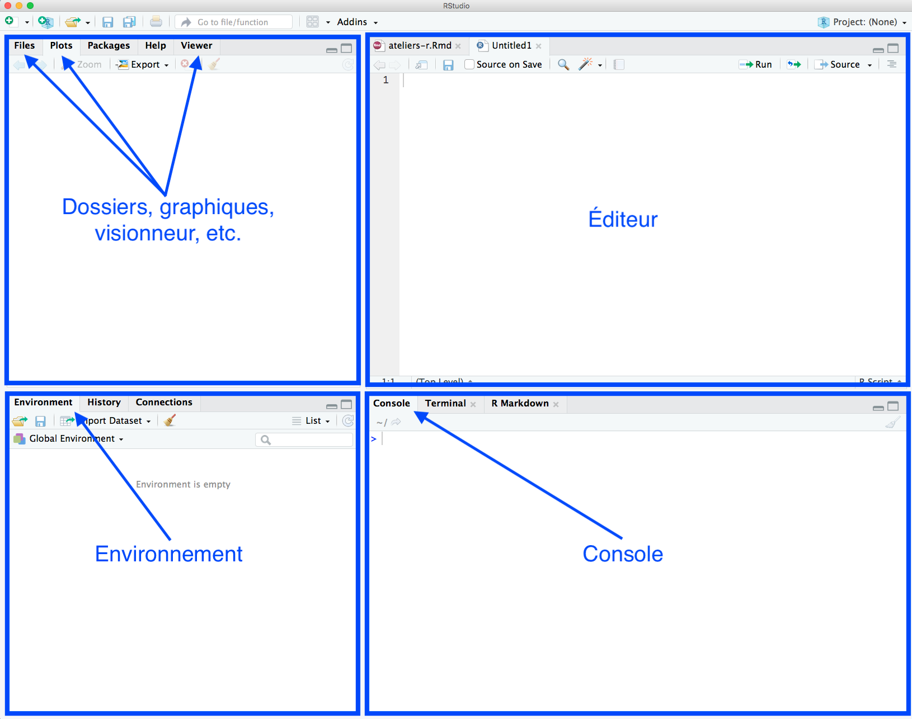

```{r setup, include=FALSE}
knitr::opts_chunk$set(echo = TRUE, collapse = TRUE, prompt = TRUE, tidy = TRUE)
```

## Bienvenue à votre introduction à R! <!--Text comment--> 

R a vu le jour en 1993. Ce langage de programmation est de plus en plus utilisé en analyse statistique. Il permet, entre autres, de visualiser des données quantitatives et de faire des analyses statistiques sur ces données. Étant donné que R est un logiciel libre, de nombreux contributeurs et de nombreuses contributrices travaillent à la création de nouvelles fonctions, qui sont rendues disponibles à tous les utilisateurs de R. 

Mes notes de cours sont inspirées de celles d'[Alexandre Blanchet](http://www.alexandreblanchet.ca/enseignement/). Je vous conseille de consulter son site pour une introduction très complète à l'inférence statistique en R. Sinon, il existe de nombreuses autres ressources en ligne.

Sites en français: 

* Même si la plupart des forums d'aide sur R sont en anglais, il existe tout de même des blogs francophones qui permettent de démystifier certaines fonctionnalités. Entre autres, on retrouve [ElementR](https://elementr.hypotheses.org/) et [R-atique](http://perso.ens-lyon.fr/lise.vaudor/category/tous-les-posts/).
* Le [Groupe des utilisateurs du logiciel R](http://forums.cirad.fr/logiciel-R/) est un forum francophone sur R.
* Le site [FUN Mooc](https://www.fun-mooc.fr/courses/course-v1:UPSUD+42001+session10/about) est une plateforme internet gratuite d'enseignement supérieur. On y offre le cours "Introduction à la statistique avec R".
* L'université Lyon 2 offre le cours "Programmation sous R". Le contenu du cours est disponible sur ce [site](http://eric.univ-lyon2.fr/~ricco/cours/cours_programmation_R.html).
  
En anglais:

* Vous tomberez probablement assez vite sur [Stack Overflow](https://stackoverflow.com/) en cherchant des réponses concernant R sur Google. La communauté d'utilisateurs du langage R est très active sur ce site, qui est organisé sous forme de questions-réponses.
* Je consulte régulièrement le site [R-bloggers](https://www.r-bloggers.com/).
* Pour suivre des formations en ligne, il existe le site [Coursera](https://www.coursera.org/). Les cours ont le format de cours universitaires, mais avec la version gratuite: pas besoin de suivre l'entièreté des plans de cours (ni de remettre les travaux).

### Un aperçu de R Studio

R Studio est un environnement permettant de travailler avec le langage R dans un espace plus convivial et intuitif. Voici ce à quoi ressemble l'interface de R Studio. 

{width=450px}

Il est possible, si vous le désirez, de réorganiser l'apparence de R Studio en allant dans l'onglet _R studio --> preferences... --> Appearance/Pane Layout_.

## Pour commencer

### Ouvrez et enregistrez un nouvel éditeur R (_R script_). 
C'est dans l'éditeur que vous entrerez toutes vos commandes. En entrant les commandes dans un éditeur (et en ayant enregistré cet éditeur sur votre ordinateur!), vous vous assurez de conserver une trace de votre travail. Évitez d'entrer des lignes de codes directement dans la console, puisque vous n'enregistrerez pas la console à la fin de votre travail. 

### Définissez un répertoire
Dans votre éditeur, commencez par définir votre répertoire (en anglais: _working directory_) à l'aide de la fonction `setwd()`. Il est aussi possible d'enregistrer votre répertoire en allant dans _Session --> Set working directory --> Choose directory..._
```{r, eval=FALSE}
setwd("~/université/cours/métho/r")
```
Le _working directory_ est l'endroit où R ira chercher les données que vous importerez dans votre environnement (il faut donc placer vos banques de données à cet endroit sur votre ordinateur). C'est aussi à cet endroit que seront placés vos modèles, tableaux, graphiques, etc. lorsque vous demanderez à R de les enregistrer.  

## Commandes de base

### Faire des commentaires/prendre des notes
À tout moment, vous pouvez prendre des notes pour vous-même dans votre éditeur. Les notes sont tout ce qui est précédé d'un ou plusieurs signes de dièse (`#`). Ces lignes ne seront pas "lues" par R au moment d'exécuter les commandes.
```{r}
# Ceci est une note -- elle ne sera pas exécutée par R. Annoter votre éditeur vous permet de revenir à votre code plus tard, et de comprendre ce que vous avez fait. Un code bien annoté vous fera gagner du temps! Il vous permettra aussi de facilement partager vos analyses.
```


### Exécution des commandes
Pour exécuter une commande, placez votre curseur sur la ligne que vous souhaiter exécuter, puis appuyez sur CMD + ENTER (en mac) ou sur CTRL + ENTER (en windows). Vous pouvez aussi sélectionner une (ou plusieurs) lignes et cliquer sur le bouton _Run_ en haut de votre éditeur.  

### Explorer une commande
Lorsque que vous n'êtes pas certain de savoir à quoi sert une commande ou comment elle doit être utilisée, la première étape est de l'explorer dans l'assistant R à l'aide du `?`. 
```{r tidy = FALSE}
?setwd
```
Le résultat apparaîtra dans l'onglet _Help_.

### Commandes mathématiques
On peut se servir de R comme d'une calculatrice. Par exemple, on peut faire des additions (`+`), des soustractions (`-`), des divisions (`/`) et des multiplications (`*`). De nombreuses autres opérations mathématiques peuvent y être utilisées. 
```{r}
4 + 2

4*2

# Moyenne: je demande à R de calculer la moyenne des chiffres 4 à 10 (le symbole ":" signifie "à")
mean(4:10) 

# Médiane
median(20:27) 
```
Attention, R est sensible aux majuscules!

### Assigner des valeurs à des objets
R est un langage "orienté objet" (_object oriented_). En R, on crée des "objets" et on leur assigne des données. Prenons un exemple simple: nous créons deux variables, nommées `variable.x` et `variable.y`, et leur assignons à chacun une valeur. On assigne une valeur à un objet à l'aide du symbole `<-` ou `=`.
```{r}
variable.x <- 2  
variable.y = 3

# En tapant le nom de l'objet, R nous renvoit son contenu
variable.x

# On peut ensuite faire des opérations mathématiques sur ces objets
variable.x - variable.y

# On peut même créer un objet qui sera le résultat d'une opération 
operation = variable.x*variable.y

operation
```

## Types de données
Les trois types de données les plus utiles sont les caractères, les numériques et les booléens.

### Caractères
Il s'agit de texte. Ce type de données sera entouré de guillemets.
```{r}
"ceci est ma première variable"

# Pour conserver cette donnée, il faut l'assigner à un objet: elle apparaît maintenant dans notre environnement.
coucou <- "ceci est ma première variable"

# Affichons le contenu de l'objet "coucou".
coucou
```

### Numériques
Les données numériques sont des nombres, elles ne sont pas entourées de guillemets.
```{r}
une.donnee.num <- 2.5
une.donnee.num
```

### Booléens
Les booléens sont des expressions logiques. Ils prennent la forme `TRUE` ou `FALSE`. 
```{r}
3 < 2
# R retourne "FALSE" parce que 3 n'est pas plus petit que 2

# On peut assigner un énoncé logique à un objet
boule = 4*2 > 3+1

# Affichons cet objet
boule
```
La valeur `TRUE` est assignée à l'objet `boule`, puisque `4*2` est plus grand que `3+1`.

## Structures de données

Les données peuvent avoir différentes structures. Plus haut, chaque objet que nous avons défini ne contenait qu'une seule donnée. L'objet `coucou` ne contient qu'une seule donnée de type caractère, soit la phrase `ceci est ma première variable`. L'objet `une.donnee.num` ne contient qu'une seule donnée de type numérique, soit `2.5`. Et ainsi de suite. La plupart du temps, on voudra assigner plusieurs données à un même objet. Il faudra donc organiser ces données selon une certaine structure.

### Vecteur
Les vecteurs sont une série de données du même type.
```{r}
fibonacci <- c(1, 1, 2, 3, 5, 8, 13, 21, 34, 55, 89, 144, 233, 377, 610, 987, 1597, 2584)
fibonacci 

ma.famille <- c("Francine", "Antoine", "Justin")
ma.famille
```

Rappelez-vous que les vecteurs sont des données du même type, donc si on mélange les types, toutes les données seront converties en un seul type.
```{r}
fibonacci2 <- c(1, 1, 2, 3, 5, 8, 13, 21, "trente-quatre")

fibonacci2 
# Ici, tout a été converti en caractère (entouré de guillemets)

# On peut appliquer des commandes mathématiques aux vecteurs
median(fibonacci)

# Pour sélectionner des données dans un vecteur, on peut utiliser les crochets: je demande à R de sortir la 4e donnée du vecteur "fibonacci"
fibonacci[4] 

# Et la 1ère et 2e données du vecteur "ma.famille"
ma.famille[c(1, 2)] 

# Je pourrais assigner les deux premiers éléments du vecteur "ma.famille"" à un autre vecteur, que je nommerai "mes.parents".
mes.parents <- ma.famille[c(1, 2)]
mes.parents
```

### Liste
Les listes peuvent contenir différents types de données. Elles peuvent aussi contenir des structures de données, comme des vecteurs (mise en abîme des données!).
```{r}
famille.taille = list("Francine", 5.6, "Antoine", 5.8, "Justin", 5.3) 
famille.taille

# Organisons une liste contenant des vecteurs (mise en abîme!)
famille.taille2 = list(c("Francine", "Antoine", "Justin"), c(5.6, 5.8, 5.3))
famille.taille2
# Le 1er élément de cette liste est un vecteur de 3 prénoms, tandis que le 2e élément de la liste est un vecteur de 3 nombres.

# Je pourrais faire une liste qui associe chaque membre de ma famille à leur taille 
famille.taille3 = list("Francine" = 5.6, "Antoine" = 5.8, "Justin" = 5.3)
famille.taille3

# De cette façon, je peux accéder directement à la taille d'un des membres de ma famille en utilisant les double [ ]
famille.taille3[["Francine"]]

famille.taille3[1]
# Cela me renvoit le premier élément de la liste. Il s'agit de Francine, et de sa taille.
```

### _Data frame_

Un _data frame_ (désolée, je n'ai pas trouvé de traduction satisfaisante) contient des données organisées en rangées et en colonnes, comme dans un tableau. Chaque colonne peut avoir un type différent, mais les données _au sein_ d'une même colonne doivent être du même type. Généralement, les colonnes seront associées aux variables, tandis que chaque rangée correspondra à une observation.  
```{r}
famille.info = data.frame("Noms" = c("Francine", "Antoine", "Justin", "Juliette", 
                                     "Pierre", "Guillaume"), 
                          "Taille" = c(5.6, 5.8, 5.3, 5.4, 5.3, 6.0), 
                          "Yeux" = c("bruns", "bleus", "verts", "bruns", "bruns", 
                                     "bruns"), 
                          "Naissance" = c(1967, 1968, 1983, 1990, 1979, 1985))

# Affichons cet objet 
famille.info
```
Cette _data frame_ compte 6 observations (`Francine, Antoine, Justin, Juliette, Pierre, Guillaume`) et 4 variables (`Noms, Taille, Yeux, Naissance`).

On peut extraire les données qui se trouvent dans une _data frame_.
```{r}
# À l'aide du symbole "$", R nous donnera le contenu de cette colonne sous forme de vecteur
famille.info$Taille 

# On peut sélectionner plus d'une colonne à l'aide de la notation [ , ]: Ce qui est inscrit avant la virgule correspond à la rangée, ce qui vient après la virgule correspond à la colonne
famille.info[, c("Noms", "Yeux")] 

# Ici, on n'a rien précisé pour la rangée, R nous a donc renvoyé le contenu entier des deux colonnes qu'on a précisées. On peut obtenir la même chose en précisant le numéro des colonnes que l'on veut obtenir (la 1ere et la 3e colonne).
famille.info[, c(1, 3)] 

# On peut faire la même chose pour les rangées. Par exemple, le contenu des rangées 1 à 3
famille.info[1:3, ] 

# Les possibilités sont (presque) infinies! Ici, je demande à R de trouver tous les yeux "bruns" (le double "=" signifie "correspond à"). R a extrait toutes les rangées où c'est le cas. 
famille.info[famille.info$Yeux == "bruns", ] 

# On peut spécifier plusieurs conditions
famille.info[famille.info$Yeux == "bruns" & famille.info$Taille > 5.8, ] 

# Ici, je demande à R d'extraire tous les individus qui ont les yeux bruns ou (symbole |) qui mesurent plus de 5.6
famille.info[famille.info$Yeux == "bruns" | famille.info$Taille > 5.8, ] 

# Je veux savoir le noms et les dates de naissance (rien d'autre) des individus qui ont les cheveux bruns 
famille.info[famille.info$Yeux == "bruns", c("Noms", "Naissance")] 

# On peut faire des opérations mathématiques sur les data frames: calculons la moyenne des tailles 
mean(famille.info$Taille)
```

### Exercice 1

Créez une _data frame_ contenant des données d'au moins 2 types différents. Votre _data frame_ doit contenir au moins 4 rangées et 3 colonnes. En utilisant la syntaxe de votre choix, faites l'extraction de deux colonnes. Faites ensuite l'extraction d'une rangée.

## Importer et préparer les données

### Comment importer

La plupart du temps, les banques de données que vous utiliserez seront structurées en _data frame_. Comme dans un tableau Excel, les colonnes correspondront aux variables et les rangées correspondront aux observations. Si on retourne à l'exemple utilisé plus haut, `Francine` est notre première observation. La rangée qui correspond à cette observation est remplie par différentes variables concernant Francine, soit sa taille, la couleur de ses yeux et son année de naissance. 

Très souvent, vous importerez des banques de données enregistrées en format .csv (données séparées par des virgules). Il se peut que vous utilisiez des banques de données enregistrées sous d'autres formats (ou que vous importiez des banques de données qui se trouvent sur internet). L'avantage avec R, c'est qu'il existe probablement une fonction pour ouvrir ces données. Pour trouver la fonction dont vous avez besoin, je vous conseille de chercher en ligne. Il existe une grande communauté d'utilisateurs et d'utilisatrices du langage R: si vous vous posez une question, il est fort probable que quelqu'un d'autre se la soit posée auparavant! Vous n'êtes pas ignorant.e!

Avant d'importer une banque de données, il faut d'abord s'assurer qu'elle se trouve dans notre répertoire (_working directory_). Rappelez-vous: c'est avec ce répertoire que R communique. Tout ce que vous "allez chercher" doit se trouver dans le répertoire que vous avez déjà spécifié.

Pour importer un fichier .csv, on se sert de la fonction `read.csv()`.
```{r}
travail.femmes = read.csv("women-labour.csv", sep = ",")
```

Il est possible d'importer des données de nombreux formats différents. Par exemple:
```{r eval=FALSE}
baseball = read.table("https://raw.githubusercontent.com/chadwickbureau/
                       baseballdatabank/master/core/BattingPost.csv", 
                       header = TRUE, sep = ",")
```

### Présentation des données que nous utiliserons

Avant d'aller plus loin, voici une brève description de la banque de données que nous utiliserons (source: Mroz 1987, données obtenues de [Vincent Arel-Bundock](https://github.com/vincentarelbundock/Rdatasets)). Il s'agit de la banque _U.S. Women's Labor-Force Participation_, obtenu en 1975 via le _Panel Study of Income Dynamics_. Elle contient des informations 753 femmes américaines mariées. Voici les variables contenues dans cette enquête:

Variable | Description | Code
-----|---------------------------------------------------------------|------
lfp | participation au marché de l’emploi | Yes, No
k5 | nombre d’enfants âgés de 5 ans et moins | N.A.
k18 | nombre d’enfants âgés de 6 à 18 ans | N.A.
age | âge, en années | N.A.
wc | fréquentation universitaire par l’épouse | Yes, No
hc | fréquentation universitaire par l’époux | Yes, No
lwg | salaire (log) des femmes sur le marché du travail (pour les femmes qui ne sont pas sur le marché du travail, une valeur a été imputée sur la base des autres variables) | N.A.
inc | revenu du ménage excluant celui de l’épouse | N.A.

### Explorer vos données

On peut explorer nos données à l'aide de certaines fonctions. 
```{r}
# Voir les premières rangées de la banque de données
head(travail.femmes)

# Voir les dernières rangées
tail(travail.femmes)
```

### Recoder

Recoder des variables est une action fréquente pour tout.e chercheur.se ayant recours à des données quantitatives. Avec le temps, vous trouverez votre propre stratégie pour recoder des variables de la manière qui vous convient le mieux. Ici, l'essai-erreur deviendra votre meilleur ami (et parfois pire ennemi). 
```{r, tidy=FALSE}
# Nous aimerions créer une variable nommée "pgm" qui prendrait la valeur de 
# 1 pour les femmes ayant vécu la Première Guerre mondiale (i.e. qui ont plus 
# de 57 ans), et de 0 pour les autres
travail.femmes$pgm = ifelse(travail.femmes$age > 57, "1", "0")

# Explorons la fonction ifelse
?ifelse

# J'ai demandé à R de créer une nouvelle variable, la variable `pgm`. J'ai 
# ensuite demandé à R d'attribuer la donnée "1" à toutes les observations où 
# la variable "age" était supérieure à 57, et la donnée "0" à toutes les 
# autres observations.

# Nous aimerions créer des catégories d'âge pour chaque décennie, i.e. 30-39 
# ans, 40-49 ans et 50 ans et + 
travail.femmes$decennie = NA
travail.femmes$decennie[travail.femmes$age <= 39] = "30-39 ans"
travail.femmes$decennie[travail.femmes$age >= 40 & travail.femmes$age <= 49] = 
  "40-49 ans"
travail.femmes$decennie[travail.femmes$age >= 50] = "50 ans et plus"
```

Un truc pour vérifier que votre recodage a bel et bien fonctionné: faire un tableau croisé.
```{r}
table(travail.femmes$decennie, travail.femmes$age)
```

### Diviser une banque de données

```{r}
# Éliminer la première colonne, qui est une relique du document importé
travail.femmes = travail.femmes[,-1]

# Rappel: ce qui vient avant la virgule concerne les lignes, ce qui vient après la virgule concerne les colonnes

# Créons une nouvelle banque avec les colonnes 1 à 8 (notez la virgule avant le c)
femmes2 = travail.femmes[,c(1:8)]

# Gardons seulement les variables sur le nombre d'enfants et le revenu familial
femmes3 = travail.femmes[,c("k5", "k618", "inc")]

# Gardons toutes les répondantes qui n'ont pas d'enfants en bas de 5 ans (pour lesquelles il y a un "0" à la variable "k5")
aucun.k5 = travail.femmes[travail.femmes$k5 != 0,]
```

## Statistiques descriptives et analyses univariées

Une fois votre banque de données bien "nettoyée", vous pouvez vous lancer dans l'analyse statistique. Une première étape pertinente est d'explorer vos données de façon descriptive ou de faire des analyses sur une variable à la fois (univariées). Par exemple:
```{r}
# Tableaux de fréquences
table(travail.femmes$k618)
```

Ce type de tableau, avec les fréquences à l'horizontal, n'est peut-être pas le plus intuitif, surtout si la variable qui vous intéresse a beaucoup de catégories. Pour remédier à la situation, nous utiliserons la fonction `count()`.
```{r eval=FALSE}
# Exécutons la fonction suivante 
count(travail.femmes$k618)
```

R devrait renvoyer un message d'erreur. La fonction `count()` est introuvable. La raison est la suivante: R contient en tout temps certaines fonctions de base, comme celles que nous avons utilisées depuis le début de cet atelier (`setwd()`, `table()`, `mean()`, etc.). Or, pour utiliser d'autres fonctions, il est nécessaire d'installer des paquets (_packages_). Il existe des centaines de paquets, que les collaborateurs et collaboratrices du langage R travaillent à développer. Ces paquets contiennent des fonctions qui vous permetteront de réaliser diverses actions. Souvent, la seule manière pour vous de connaître l'existence d'une fonction (et de son paquet) sera de faire des recherches sur internet.

Ma recherche internet m'indique que la fonction `count()` se trouve dans le paquet nommé `plyr`. Installons-le.
```{r eval=FALSE}
install.packages("plyr")
```

La deuxième étape essentielle est d' "appeler" le paquet à l'aide de la fonction `library()`.
```{r}
library(plyr)
```

Il faut voir la fonction `library()` comme un service de bibliothécaire (littéralement). Après avoir installé le _package_ `plyr`, ce dernier se trouvait en mémoire de R. Cependant, il vous était encore impossible de l'utiliser parce que vous ne l'aviez pas "fait venir à la surface".

Maintenant que tout est installé, retournons à nos statistiques descriptives:
```{r}
count(travail.femmes$k618)
```

Il est également possible de visualiser nos variables à l'aide de graphiques.
```{r out.width = '60%'}
hist(travail.femmes$age)
```

Il est possible de calculer des mesures de tendances centrales, comme la moyenne et la médiane.
```{r}
# Moyenne d'âge des répondantes
mean(travail.femmes$age) 

# Calcul de la moyenne de la variable lfp, pour connaître le nombre de femmes qui sont sur le marché du travail
mean(travail.femmes$lfp) 

# R renvoit un message d'erreur parce que la variable n'est pas numérique
is.numeric(travail.femmes$lfp) 

# Je peux calculer la moyenne de la variable lfp en la dédoublant en variable numérique 
travail.femmes$lfp.num = as.numeric(travail.femmes$lfp)
table(travail.femmes$lfp.num, travail.femmes$lfp)

mean(travail.femmes$lfp.num)

# Âge moyen des femmes qui travaillent seulement
mean(travail.femmes$age[travail.femmes$lfp=="yes"]) 

# Les femmes qui travaillent sont en moyenne plus jeunes que les femmes qui ne travaillent pas.

# Calcul de l'écart type 
mean(travail.femmes$k618) 
sd(travail.femmes$k618)

# En moyenne, les répondantes ont 1.35 enfant de 6 à 18 ans. L'écart-type associé à cette statistique est 1,32.

# Je voudrais savoir le nombre total d'enfants qu'ont ces répondantes
travail.femmes$enfants = travail.femmes$k618 + travail.femmes$k5
count(travail.femmes$enfants)
```

## Analyses bivariées et statistiques inférentielles

R peut servir à analyser la relation entre deux ou plusieurs variables. De nombreux tests, comme la corrélation de Pearson, sont disponibles sur R. Après avoir analysé la force de la relation entre deux variables, vous pouvez également tester la signification statistique de cette dernière à l'aide, par exemple, de tests comme le khi carré.

Première question: La participation des femmes au marché de l'emploi (`lfp`) est-elle liée au fait qu'elles aient fréquenté l'université (`wc`)?
```{r}
# Faisons un tableau croisé pour visualiser la relation (potentielle)
table(travail.femmes$lfp, travail.femmes$wc)

# Faisons des variables numériques pour lfp et wc
travail.femmes$wc.num = ifelse(travail.femmes$wc == "yes", 1, 0)
travail.femmes$hc.num = ifelse(travail.femmes$hc == "yes", 1, 0)

# Corrélation
cor(travail.femmes$lfp.num, travail.femmes$wc.num)
```

La corrélation entre la participation au marché de l'emploi et la fréquentation universitaire est très faible (0.14). Pour connaître le niveau de signification statistique, utilisons la fonction `rcorr()` du paquet `Hmisc`.
```{r eval=FALSE}
install.packages("Hmisc")
```

``` {r message=FALSE}
library(Hmisc)

rcorr(travail.femmes$lfp.num, travail.femmes$wc.num)
# rcorr nous donne la statistique p associée à chaque corrélation
# L'association statistique entre lpf et wc est significative à ~0.0001

# Pour connaître la signification statistique, on peut aussi utiliser le khi carré
chisq.test(travail.femmes$lfp.num, travail.femmes$wc.num)
```

## Régression linéaire et analyses multivariées

Enfin, R nous permet de faire des analyses de régression par les moindres carrés ordinaires (_OLS_). Passons en revue les éléments les éléments à inclure dans la fonction `lm()`.
```{r, tidy=FALSE}
?lm
```

Est-ce que le nombre d'enfants est associé au salaire des femmes? On pourrait poser l'argument selon lequel les femmes qui ont plus d'enfants ont un salaire moins élevé que les autres, puisqu'elles ont dû s'absenter du marché du travail pour une plus longue période de temps. Or, l'ancienneté et l'expérience sont généralement associées positivement au salaire, et les législations relatives à l'équité salariale et aux congés de parentalité étaient encore moins répandues en 1975. 

Le salaire des femmes (`lwg`) est la variable dépendante, tandis que le nombre d'enfants (`enfants`) est la variable indépendante, que nous avons créée plus tôt. N'oubliez pas que la variable `lwg`, dans cet échantillon, est le log du salaire. Elle va de -2.05 à 3.2. Traçons l'histogramme pour voir.
```{r out.width = '60%'}
hist(travail.femmes$lwg)
```

La variable du salaire est souvent exprimée en log, parce que dans la population, la distribution des salaires ne suit souvent pas une distribution normale. Dans la population, il y a généralement quelques individus très fortunés qui représentent une proportion très limitée des travailleurs, alors que la majorité des personnes ont un revenu beaucoup plus bas. Voyez ce à quoi ressemble la distribution réelle des salaires des répondantes de cette enquête: 
```{r out.width = '60%'}
hist(exp(travail.femmes$lwg))
```

Les chercheurs ayant mené cette étude ont donc utilisé le log pour donner une distribution normale à la variable "salaire". 

Fermons la parenthèse et revenons à notre modèle linéaire. Le nombre d'enfants affecte-t-il négativement le salaire de nos répondantes?
```{r}
# Estimation du modèle
modelelineaire = lm(lwg ~ enfants, data = travail.femmes)

# Résultats
modelelineaire

# Résultats avec statistiques inférentielles
summary(modelelineaire)
```
Portez votre regard sur la colonne `Estimate`. Le coefficient associé à la variable `enfants` est égal à -0.04. 

Interprétons: dans cet échantillon de femmes américaines, une augmentation d'un enfant est associé avec une diminution (du log de) de son salaire de 0.04. En bref, une augmentation dans le nombre d'enfants est associé à une diminution du salaire pour ces femmes américaines.

La statistique `P` associée à cette relation nous indique qu'il s'agit d'une relation statistiquement significative (à < 0.01). Le coefficient de -0.04 se trouve dans une intervalle allant d'environ -0.05 à -0.03, au moins 99 fois sur 100. Ici, je vous réfère à vos livres de statistiques inférentielles pour vous familiariser avec l'interprétation. Mais pour résumer, si nous répétions la même analyse avec une infinité d'échantillons, nous obtienderions un coefficient se trouvant entre -0.05 et -0.03 au moins 99 fois sur 100. Il s'agit d'un niveau de signification statistique accepté dans la littérature en science politique (généralement, on accepte < 0.05).

Il est possible que d'autres facteurs expliquent aussi la relation négative entre le nombre d'enfants et le salaire. 

- Par exemple, il est possible que les femmes plus âgées aient plus d'enfants (entre autres, parce qu'elles sont nées à une époque où les familles étaient plus nombreuses) _et_ qu'elles aient un salaire moins élevés (parce qu'au moment où elles ont intégré le marché du travail, les salaires des femmes étaient encore plus bas). 
- D'autre part, il est possible que le niveau d'éducation affecte le nombre d'enfants _ainsi_ que le salaire. 

La relation entre le nombre d'enfants et le salaire est donc peut-être fallacieuse. Pour vérifier cette possibilité, ajoutons des variables de contrôle à notre modèle: l'__âge de la répondante__ et le __fait qu'elle soit allée à l'université__.
```{r}
modelecontrole = lm(lwg ~ enfants + age + wc.num, data = travail.femmes)

summary(modelecontrole)
```
Après avoir ajouté ces deux variables, on note que la relation entre l'âge et le salaire est légèrement négative (-0.001) et non-significative (p=0.54). Le fait d'être allée à l'université est quant à lui positivement corrélé avec le salaire des répondantes. En moyenne, le (log du) salaire des femmes ayant fréquenté l'université est 0.4 plus élevé que le (log du) salaire des femmes n'ayant pas fréquenté l'université. Si on menait cette analyse à nouveau, notre coefficient se trouverait dans l'intervalle de 0.35 à 0.45 au moins 99.9% du temps.

Est-ce que la relation négative entre le nombre d'enfants et le salaire tient encore, malgré l'introduction des variables "âge" et "fréquentation de l'université"? Il semblerait que oui. Même en contrôlant l'âge et la fréquentation universitaire, chaque enfant supplémentaire fait diminuer le salaire des répondantes de ce sondage. De plus, cette relation peut être généralisée à la population dont est tiré cet échantillon (p<0.01).

### Exercice 2

Testez une hypothèse de recherche à l'aide des données du _U.S. Women's Labor-Force Participation_. Composez un modèle de régression linéaire avec au moins une variable de contrôle et interprétez les coefficients ainsi que les niveaux de signification statistique.

## Pour vos projets futurs

Cette introduction à R a effectué un survol des principales fonctionnalités de ce langage, très utile en analyse statistique. Il vous aura appris, je l'espère, à utiliser les fonctions de base en R, à importer des bases de données, à recoder des variables, à utiliser des _packages_, à visualiser vos données et à faire des analyses univariées, bivariées ainsi que des régressions linéaires multivariées. Vous pouvez maintenant utiliser R pour mener d'autres types d'analyses statistiques, comme les régressions logistiques. Je vous invite à explorer les sources citées plus haut si vous avez des questions en cours de cheminement. R est un outil très flexible, vous serez surpris.e des possibilités qui s'ouvrent à vous en termes de modélisation et de visualisation de données! 
