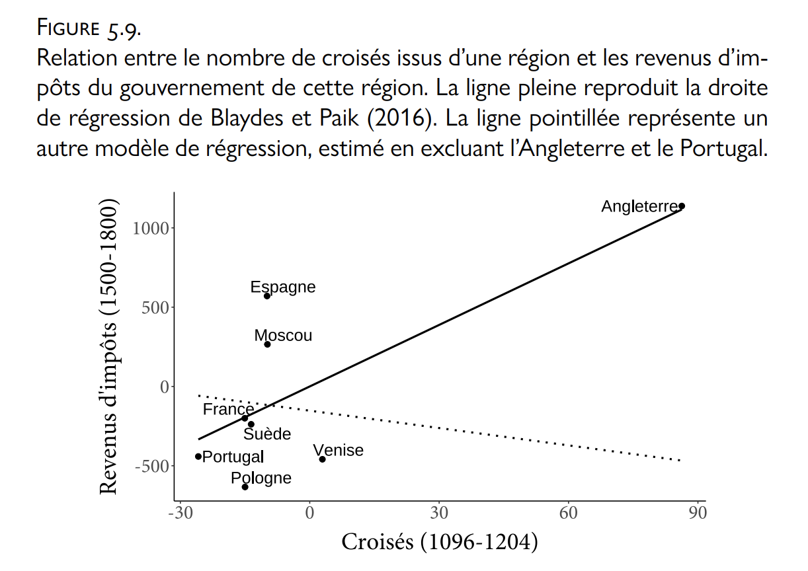

```{r setup, include=FALSE}
knitr::opts_chunk$set(echo = TRUE, tidy = T, error = F, warning = F, message = F)
library(tidyverse)
library(broom)
#https://rstudio-pubs-static.s3.amazonaws.com/27777_55697c3a476640caa0ad2099fe914ae5.html#/18
#https://vincentarelbundock.github.io/Rdatasets/datasets.html
```

# Cours 1: Plan de cours et introduction à R

# La visualisation des données

## Pourquoi visualiser les données? 

{width=60%}

Figure tirée de [Arel-Bundock, 2020.](http://arelbundock.com/index_fr.html)

## Pourquoi visualiser les données? Non, mais vraiment?

1. Explorer une quantité importante de données
2. Découvrir des tendances
3. Vulgariser des résultats d'analyse
4. Diagnostiquer des problèmes 
5. Découvrir des erreurs

## 1. Explorer une quantité importante de données

Exemple: Cette [visualisation](https://www.informationisbeautifulawards.com/showcase/4052-going-gray) du vieillissement de la population au Japon (Simon Carr, Han Huang, Jin Wu et Manas Sharma).

{width=70%}

## 2. Découvrir des tendances

Exemple: Cette visualisation d'associations plausibles entre X et Y, tirée du [livre d'Healy](https://socviz.co/lookatdata.html#why-look-at-data).

{width=55%}

## 3. Vulgariser des résultats d'analyse

Exemple: Au lieu de présenter des coefficients, présentons des graphiques.

```{r echo=FALSE,fig.height=2.5}
m=data.frame(v1= replicate(8,sample(0:1,100000,rep=TRUE)))

m1 <- tidy(lm(v1.1~v1.2+v1.3+v1.4,m),conf.int = T)
m1 %>% 
  dplyr::select(!c(conf.high,conf.low)) %>% 
  mutate(term = dplyr::recode(term, 
                              `(Intercept)`="Intercept",
                              `v1.2` = "Variable 2",
                              `v1.3` = "Variable 3",
                              `v1.4` = "Variable 4")) %>% 
  dplyr::rename("Variables" = term,
                "Coefficients" = estimate,
                "Erreur standard" = std.error,
                "Statistique t" = statistic,
                "Valeur p" = p.value) %>% 
  knitr::kable()

m1 %>% 
  filter(term != "(Intercept)") %>% 
  ggplot(aes(x = term, y = estimate, ymin = conf.low, ymax = conf.high)) +
  geom_pointrange()+
  labs(y = "Coefficient\n(et intervalles de confiance)", 
       x = "")+
  scale_x_discrete(labels = c("Variable 1", "Variable 2", "Variable 3")) +
  theme_minimal()
```

## 4. Diagnostiquer des problèmes 

Exemple: Cette visualisation de l'effet d'une valeur aberrante et influente, tirée du [livre d'Arel-Bundock](https://www.pum.umontreal.ca/catalogue/analyse_causale_et_methodes_quantitatives).

{width=60%}

## 5. Découvrir des erreurs de codage

Exemple: Cette visualisation d'une banque de données fictives.

```{r echo=FALSE,fig.height=3}
m=data.frame(v1= replicate(1,sample(c(99,1,2,3,4,5,6),1000,rep=TRUE)))
m2 = data_frame(v1 = 9) %>% 
  full_join(m)

ggplot(m2, aes(as.factor(v1)))+
  geom_bar()+
  labs(y = "",
       x = "Catégories")+
  theme_minimal()
```


## Comment visualiser les données

L'objet de ce cours !

# Introduction à `R`

## Contexte 

- R a vu le jour en 1993. 
- De plus en plus utilisé en analyse statistique et en recherche en sciences sociales.
    - Permet de "lire" des banques de données, de manipuler les données, de mener des analyses, de programmer des sites web et des applications, etc.
- Avantages:
    - Logiciel libre.
    - Évolutif et extrèmement flexible.
    - La communauté `R` est accueillante et ouverte.
    - Les ressources pour apprendre sont nombreuses.
- Désavantage: Courbe d'apprentissage plus abrupte que certains logiciels d'analyse statistique.

## R Studio

- R Studio est un "environnement de développement intégré" (_integrated development environment_ ou IDE).
- Il agit comme une interface entre nous (les utilisateurs) et le language `R`.
    - Il est plus facile à utiliser que l'interface `R` de base.

## Un aperçu de R Studio

{width=40%}

En ouvrant R Studio, il se peut que la fenêtre "Éditeur" soit invisible. Pour l'ouvrir, cliquez sur l'icône suivant en haut à droite de la console:

{width=8%}

## Avant de commencer à travailler: Démarrer un R Project

- Une excellente manière de garder la trace de notre travail dans `R` est de travailler au sein de "projets".
- Les projets sont des fichiers avec une extension .Rproj.
- Ils représentent des raccourcis pour ouvrir et accéder à vos fichiers.
- Pour créer un _R Project_, cliquez sur "File -> New Project...", puis "Existing Directory"
- Cliquez sur "Browse" pour sélectionner l'emplacement de votre choix sur votre ordinateur. 

## R Project: Un exemple

{width=85%}

## Pourquoi utiliser les R Projects?

- Le _R Project_ devient le répertoire de votre projet en cours.
- Lorsque vous aurez besoin d'ouvrir des données dans R Studio, vous pourrez les appeler directement. `R` "saura" qu'elles se trouvent dans un dossier lié au projet présentement ouvert.
- Lorsque vous voudrez enregistrer vos visualisations (ce qui arrivera souvent!), ces dernières s'enregistreront directement dans le projet présentement ouvert.
- Tout cela est abstrait pour vous? C'est normal! Vous comprendrez mieux l'utilité des _R Project_ à force d'utiliser R Studio. N'ayez pas peur.

## Éditeur R (R script) 

- C'est dans l'éditeur que vous entrerez toutes vos commandes (lignes de code). 
    - Cela permet de conserver une trace de votre travail. 
- Si ce n'est pas fait, ouvrez un nouveau _R script_. 
    - Pour ce faire, cliquez sur "File -> New File -> R script"
- Enregistrez ce _script_ dans vos fichiers (au même emplacement que votre _R Project_!).

<!--## Définir un répertoire

- Le répertoire (ou _working directory_) est l'endroit
- Dans votre éditeur, commencez par définir votre répertoire (en anglais: _working directory_) à l'aide de la fonction `setwd()`. 
- Il est aussi possible d'enregistrer votre répertoire en allant dans _Session-> Set working directory-> Choose directory..._

```{r, eval=FALSE}
setwd("~/université/cours/métho/r")
```

- C'est l'endroit où R ira chercher les données que vous importerez dans votre environnement (il faut donc placer vos banques de données à cet endroit sur votre ordinateur). 
- C'est aussi à cet endroit que seront placés vos modèles, tableaux, graphiques, etc. lorsque vous demanderez à R de les enregistrer.--> 

## Une première commande

- On peut se servir de `R` comme d'une calculatrice. 
- Dans votre script, écrivez la commande suivante. 

```{r}
4+2
```

- Pour l'exécuter, poser votre curseur sur la commande et cliquez sur:

{width=12%}

- La réponse apparaîtra dans la console.

## Exécution des commandes

- Il existe des façons plus efficaces d'exécuter des lignes de code.
- Placez votre curseur sur la commande que vous souhaiter exécuter, puis 
    - en Mac: appuyez sur CMD + ENTER
    - en Windows: appuyez sur CTRL + ENTER

## Annoter son script

- Il est possible d'ajouter du texte dans un script, par exemple, pour prendre des notes.
- Les notes sont précédées d'un ou plusieurs signes de dièse (`#`). 
- Ces lignes ne seront pas "lues" par R au moment d'exécuter les commandes.

```{r}
# Ceci est une note -- elle ne sera pas exécutée par R. 

4+2 # cette commande calcule la somme
```

## Les "commandements" de `R` 

1. Attention, R est sensible aux majuscules!

```{r eval=F}
mean(4:10) # calcule la moyenne de 4+5+6+7+8+9+10
Mean(4:10) # renvoie un message d'erreur
```

## Les "commandements" de `R` (2)

2. Pour savoir à quoi sert une commande, écrivez `?` dans la console, suivi du nom de la commande. Puis, exécutez cette ligne de code.

```{r tidy = FALSE}
?mean
```

Le résultat apparaîtra dans l'onglet _Help_.

## Les "commandements" de `R` (3)

3. Si vous avez besoin d'aide avec une commande, commencez par: 
    a. Explorez la commande avec `?`
    b. Posez votre question sur internet: quelqu'un d'autre a assurément déjà eu la même question!
    c. Posez votre question à un.e collègue ou à moi.

## La structure de base dans R

- R est un langage "orienté objet" (_object oriented_). 
- En R, on crée des "objets" et on leur assigne des valeurs. 
- On assigne une valeur à un objet à l'aide du symbole `<-` ("plus petit que" suivi d'un tiret) ou `=`.

```{r}
x <- 2  
y = 3

x # En tapant le nom de l'objet, R nous renvoit son contenu
```

- Les objets apparaissent dans l'onglet _Environment_ sur R Studio.

## Utiliser les objets

- On peut ensuite faire des opérations à partir de nos objets.

```{r}
x-y 

# On peut même créer un objet qui sera le résultat d'une opération 
multi = x*y
multi
```

## Types de données

- Les trois types de données les plus utiles sont: les caractères, les numériques et les booléens.
- Pour connaître le type d'une donnes, utilisez la fonction `class()`

```{r}
class(x)
```

## Caractères

- Il s'agit de texte. 
- Ce contenu est entouré de guillemets.

```{r}
coucou <- "exemple de texte"

# Affichons le contenu de l'objet "coucou".
coucou
```

## Numériques

- Il s'agit de nombres.
- Ces données ne sont pas entourées de guillemets.

```{r}
y
```

## Booléens

- Les booléens sont des expressions logiques. 
- Ils prennent la forme `TRUE` ou `FALSE`. 

```{r}
bonjour <- 3 < 2

bonjour
# R retourne "FALSE" parce que 3 n'est pas plus petit que 2
```

## Une seule donnée: c'est plutôt rare!

- Jusqu'ici, chaque objet que nous avons défini ne contenait qu'une seule donnée. 
- La plupart du temps, nous manipulerons des objets qui contiennent plus qu'une donnée
    - Comment des tableaux de données! 

<!--## Vecteur

- Les vecteurs sont une série de données du même type.
```{r}
fibonacci <- c(1, 1, 2, 3, 5, 8, 13, 21, 34, 55, 89, 144, 233, 377, 610, 987, 1597, 2584)
fibonacci 

ma.famille <- c("Francine", "Antoine", "Justin")
ma.famille
```

- Les vecteurs sont des données du même type.
- Si on mélange les types, toutes les données seront converties en un seul type.

```{r}
fibonacci2 <- c(1, 1, 2, 3, 5, 8, 13, 21, "trente-quatre")

fibonacci2 
# Ici, tout a été converti en caractère (entouré de guillemets)

# On peut appliquer des commandes mathématiques aux vecteurs
median(fibonacci)

# Pour sélectionner des données dans un vecteur, on peut utiliser les crochets: je demande à R de sortir la 4e donnée du vecteur "fibonacci"
fibonacci[4] 

# Et la 1ère et 2e données du vecteur "ma.famille"
ma.famille[c(1, 2)] 

# Je pourrais assigner les deux premiers éléments du vecteur "ma.famille"" à un autre vecteur, que je nommerai "mes.parents".
mes.parents <- ma.famille[c(1, 2)]
mes.parents
```

## Liste

- Les listes peuvent contenir différents types de données. 
- Elles peuvent aussi contenir des structures de données, comme des vecteurs (mise en abîme des données!).

```{r}
famille.taille = list("Francine", 5.6, "Antoine", 5.8, "Justin", 5.3) 
famille.taille

# Organisons une liste contenant des vecteurs (mise en abîme!)
famille.taille2 = list(c("Francine", "Antoine", "Justin"), c(5.6, 5.8, 5.3))
famille.taille2
# Le 1er élément de cette liste est un vecteur de 3 prénoms, tandis que le 2e élément de la liste est un vecteur de 3 nombres.

# Je pourrais faire une liste qui associe chaque membre de ma famille à leur taille 
famille.taille3 = list("Francine" = 5.6, "Antoine" = 5.8, "Justin" = 5.3)
famille.taille3

# De cette façon, je peux accéder directement à la taille d'un des membres de ma famille en utilisant les double [ ]
famille.taille3[["Francine"]]

famille.taille3[1]
# Cela me renvoit le premier élément de la liste. Il s'agit de Francine, et de sa taille.
```
-->

## Tableaux de données ou _Data frame_

- Un _data frame_ contient des données organisées en rangées et en colonnes, comme dans un tableau Excel. 

{width=100%}

- Les colonnes correspondent à des variables, tandis que les lignes/rangées correspondent à des observations.
- Chaque colonne peut contenir des données de différents types, mais les données _au sein_ d'une même colonne sont du même type. 

<!--## 

```{r}
famille.info = data.frame("Noms" = c("Francine", "Antoine", "Justin", "Juliette", 
                                     "Pierre", "Guillaume"), 
                          "Taille" = c(5.6, 5.8, 5.3, 5.4, 5.3, 6.0), 
                          "Yeux" = c("bruns", "bleus", "verts", "bruns", "bruns", 
                                     "bruns"), 
                          "Naissance" = c(1967, 1968, 1983, 1990, 1979, 1985))

# Affichons cet objet 
famille.info
```

- Cette _data frame_ compte 6 observations (`Francine, Antoine, Justin, Juliette, Pierre, Guillaume`) et 4 variables (`Noms, Taille, Yeux, Naissance`).

## Data frame (suite)
-->

## _Data frames_: exemple

- Certaines banques de données existent _de facto_ dans `R`.
    - C'est utile en contexte d'apprentissage.
- Pour vous familiariser avec les _data frames_, jouons avec une de ces banques de données.
    - Son nom est `ChickWeight`. Elle comprend des informations sur le poids de différents poussins selon leur régime.
    - Commençons par assigner cette banque de données à un objet.
    
```{r}
dat <- ChickWeight
```

## Explorer le contenu d'un tableau de données

- En cliquant sur l'objet `dat` dans votre environnement, celui-ci s'ouvre dans un nouvel onglet. Vous pouvez ainsi explorer les variables dans la banque de données.
- Un altervative est d'exécuter la commande suivante:

```{r eval = F}
view(dat)
```
 
## Explorer le contenu d'un tableau de données (2)

- La fonction `summary()` permet de faire apparaître un résumé du tableau de données dans la console.
- Cette fonction donne la description des différentes variables contenues dans la banque de données. 
- Ici, il y en a 4: `weight`, `Time`, `Chick` et `Diet`.

```{r}
summary(dat)
```

## Explorer le contenu d'un tableau de données (3)

- Le symbole `$` permet de sélectionner une variable (colonne) dans un tableau de données.
- En utilisation la fonction `summary()` sur une seule variable, on obtient une description de cette variable seulement.

```{r}
summary(dat$weight)
```

## Explorer le contenu d'un tableau de données (4)

- La fonction `table()` est aussi très utile pour résumer une variable de notre banque de données.

```{r}
table(dat$Diet)
table(dat$Diet, useNA = "always") # avec les valeurs manquantes 
```

- Dans la variable `Diet`, le chiffre 1 apparaît 220 fois, le chiffre 2 apparaît 120 fois, etc.

## Explorer le contenu d'un tableau de données (5)

- Il est possible de faire des opérations sur des variables de notre tableau de données.
- Calculons la moyenne de la variable `weight`:

```{r}
mean(dat$weight)
```

## Exercice 1

1. Assigner la banque de données `ToothGrowth` à un objet nommé `donnees`.
2. Combien de variables se trouvent dans ce tableau de données?
3. De quel _type_ (ou classe) est la variable `supp`.
4. Assignez la variable `len` à un nouvel objet, nommé `variable`.
5. Calculez la médiane de la variable `len` à l'aide de la fonction `median()`.
6. Combien de fois la catégorie `OJ` se retrouve-t-elle dans la variable `supp`?

## Exercice 1 - Correction

```{r}
# Question 1. 
donnees <- ToothGrowth

# Question 2. 
summary(donnees)
length(donnees)
view(donnees)
```

## Exercice 1 - Correction (suite)

```{r}
# Question 3. 
class(donnees$supp)

# 4. 
variable = donnees$len
```

## Exercice 1 - Correction (suite)

```{r}
# Question 5. 
median(donnees$len)
median(variable)
```

## Exercice 1 - Correction (suite)

```{r}
# Question 6. 
table(donnees$supp)
summary(donnees$supp)
```

## Importer un tableau de données avec `R`

- Pour importer votre propre banque de données dans R Studio, commencez par enregistrer le fichier au même emplacement que votre `R Project` dans votre ordinateur.
- Dans ce cours, nous travaillerons surtout avec des fichiers de données de format `.csv` (données séparées par des virgules).
- La fonction `read.csv()` permet de lire ces fichiers dans R Studio.

## Importer un tableau de données: Exemple

- J'ai placé un fichier nommé "midwest.csv" au même emplacement que mon `R Project` dans mon ordinateur.
- Je peux donc "appeler" ce fichier en exécutant la commande suivante:

```{r}
exemple_dat = read.csv("files/midwest.csv")
```

## Explorer vos propres données

- Une fois votre tableau de données importé dans `R`, vous pouvez faire n'importe quel type d'exploration sur les variables comprises à l'intérieur.
- Pour ce faire, référez-vous aux commandes que nous avons utilisées plus haut (`summary()`, `table()`, `view()`, etc.).

```{r}
# Par exemple:
table(exemple_dat$state)
```


<!--## Recoder

## Diviser une banque de données

## Statistiques descriptives et analyses univariées-->

## Ressources

## Ressources en français

- [ElementR](https://elementr.hypotheses.org/).
- [R-atique](http://perso.ens-lyon.fr/lise.vaudor/category/tous-les-posts/).
- Le [Groupe des utilisateurs du logiciel R](http://forums.cirad.fr/logiciel-R/).
- Le site [FUN Mooc](https://www.fun-mooc.fr/courses/course-v1:UPSUD+42001+session10/about).
- L'université Lyon 2 offre le cours ["Programmation sous R"](http://eric.univ-lyon2.fr/~ricco/cours/cours_programmation_R.html).
  
## Ressources en anglais:

- [Stack Overflow](https://stackoverflow.com/) 
- [R-bloggers](https://www.r-bloggers.com/).
- [Coursera](https://www.coursera.org/). 

# À la semaine prochaine!
