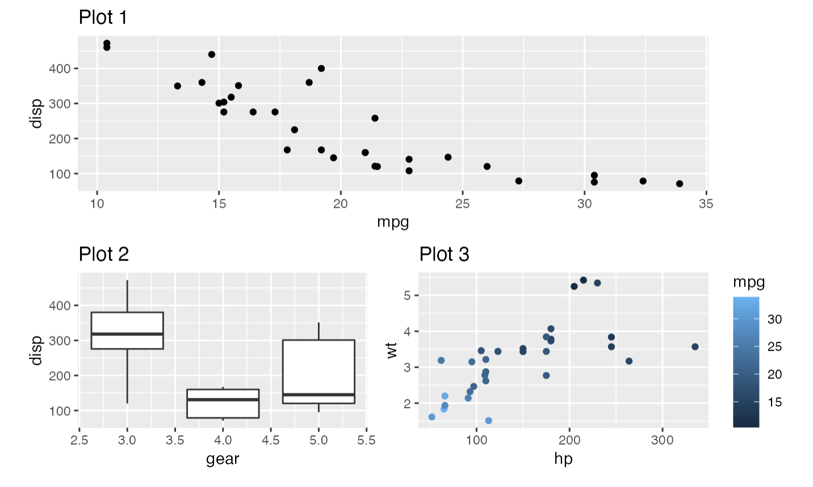

```{r setup, include=FALSE}
knitr::opts_chunk$set(echo = TRUE, tidy = F, error = F, warning = F, message = F, fig.width = 5, fig.height = 3)
```

# Cours 10: Méli-mélo

## Plan de match

1. Les fameuses polices de caractère
2. Le package patchwork
3. Nouveaux types de graphs
4. RMarkdown

# Polices de caractère

## Avant tout

```{r}
library(tidyverse)
```

## Que s'est-il passé avec `extrafont`?

- Hypothèse: https://github.com/wch/extrafont/issues/88

```{r eval = F}
library(extrafont)
sessionInfo()
# vérifier la version de Rttf2pt1 (tout en bas)

# si la version est 1.3.9, essayer: 
remotes::install_version("Rttf2pt1", version = "1.3.8")

# puis: 
extrafont::font_import()
```

## Sans utiliser `extrafont`

```{r}
dat = mtcars

# aller voir les polices disponibles dans votre ordi, puis:
ggplot(data = dat, aes(mpg, disp)) +
  geom_point() + 
  labs(title = "Test") +
  theme(text = element_text(family = "Arial Narrow"))
```

## Sans utiliser `extrafont` (2)

```{r}
# installer une nouvelle police, comme:
# https://fonts.google.com/specimen/Roboto
# puis:
ggplot(data = dat, aes(mpg, disp)) +
  geom_point() + 
  labs(title = "Test") +
  theme(text = element_text(family = "Roboto"))
```

## `showtext`

```{r}
library(showtext)
font_add_google("Oswald", "oswald")

showtext_auto()
p = ggplot(data = dat, aes(mpg, disp)) +
  geom_point() + 
  labs(title = "Test") +
  theme(text = element_text(family = "oswald"))

ggsave("test_font_showtext.png")
showtext_auto(F)
```

# `patchwork`

## Pour combiner des graphs

{width=60%}

Auteur: [Thomas Lin Pederson](https://www.data-imaginist.com/art)

## Pour combiner des graphs

```{r}
# https://patchwork.data-imaginist.com/
library(patchwork)

p1 = ggplot(data = mtcars, aes(disp, hp)) +
  geom_point()
p2 = ggplot(data = mtcars, aes(vs)) +
  geom_bar()
p3 = ggplot(data = mtcars, aes(mpg, drat)) +
  geom_line()
```

## Pour combiner des graphs

```{r}
# simplement utiliser le signe d'addition
p1 + p2 + p3
```

## Pour combiner des graphs

```{r}
# la barre oblique pour superposer
p1 / p2
```

## Pour combiner des graphs

```{r}
# les parenthèses pour regrouper
(p1 + p2) / p3
```

## Pour combiner des graphs

```{r}
# la barre verticale pour mettre côte-à-côte
p1 | (p2 / p3)
```

## Pour combiner des graphs

```{r}
# déterminer l'organisation
p1 + p2 + p3 + plot_layout(nrow = 2)
```

## Pour combiner des graphs

```{r}
# annoter et modifier le thème (&)
(p1 + p2) + 
  plot_annotation(title = "Titre",
                  subtitle = "Sous-titre") &
  theme(plot.title = element_text(size = 20))
```

## `patchwork`: et encore plus!

- Enregistrer
- Jouer avec la taille
- Numéroter les graphs
- Normaliser les légendes
- etc.

# Nouveaux types de graphs

## Lollipop graphs

```{r echo = F}
mtcars2 = mtcars %>% 
  mutate(auto = rownames(.)) # le point fait référence à "mtcars"

ggplot(data = mtcars2, 
       aes(y = reorder(auto, -mpg), x = mpg)) +
  geom_point() +
  geom_segment(aes(x = 0, xend = mpg, y = auto, yend = auto)) +
  labs(title = "Consommation de carburant selon la voiture",
       x = "Miles parcourus pour un gallon",
       y = "") +
  theme_minimal()
```

## Lollipop graphs

```{r}
mtcars2 = mtcars %>% 
  mutate(auto = rownames(.)) # le point fait référence à "mtcars"

ggplot(data = mtcars2, 
       aes(y = reorder(auto, -mpg), x = mpg)) +
  geom_point() +
  geom_segment(aes(x = 0, xend = mpg, y = auto, yend = auto)) +
  labs(title = "Consommation de carburant selon la voiture",
       x = "Miles parcourus pour un gallon",
       y = "") +
  theme_minimal()
```

## Graphiques animés

```{r}
dat = read.csv("files/skater_stats.csv")
# source: http://inalitic.com/datasets/nhl%20player%20data.html
```

## Graphiques animés

```{r}
p = ggplot(data = dat,
           aes(x = Age,
               group = Season)) +
  geom_density(fill = "black", alpha = .2) + 
  theme_minimal() +
  theme(legend.position = "") 

p
```

## Graphiques animés

```{r eval = F}
library(gganimate)

# exécutez cela dans la Console directement
p + transition_time(Season) + 
  labs(title = "Saison: {frame_time}")
```

## Graphiques animés

```{r}
dat2 = dat %>% 
  group_by(Season,Tm) %>% 
  mutate(mediane = median(Age, na.rm = T)) %>% 
  ungroup() %>% 
  distinct(Season,Tm,mediane) %>% 
  filter(str_detect(Tm, "MTL|TOR"))
```

## Graphiques animés

```{r}
p1 = ggplot(data = dat2,
       aes(y = mediane,
           x = Season, 
           color = Tm)) +
  geom_point() +
  geom_line() +
  scale_color_manual(name = "", 
                     values = c("red", "blue")) +
  labs(x = "",
       y = "Âge médian",
       title = "Age médian des joueurs",
       subtitle = "Canadiens de Montréal et Maple Leafs de Toronto") +
  theme_minimal()

p1
```

## Graphiques animés

```{r eval = F}
p2 = p1 + transition_reveal(Season) 

animate(p2, fps = 4)
anim_save("graph_anime.gif", animation = last_animation())
```


# RMarkdown

## Les options des bribes

- on ajoute les options à l'intérieur de `{r ...}`
- les options permettent de modifier le comportement de la bribe
- par exemple: 
    - `include =`
    - `echo =`
    - `eval =`
    - `message =`
    - `fig.height =`
    
## Cheat sheet

{width=60%}

## Les options globales

- la première bribe contient `knitr::opts_chunk$set`
- cela ajuste les options "globales", soit les options appliquées à toutes les bribes

```{r eval = F}
# exemple
knitr::opts_chunk$set(echo = T, error = F, message = F, fig.width = 5)
```


# À la semaine prochaine! (atelier pour le travail final)


