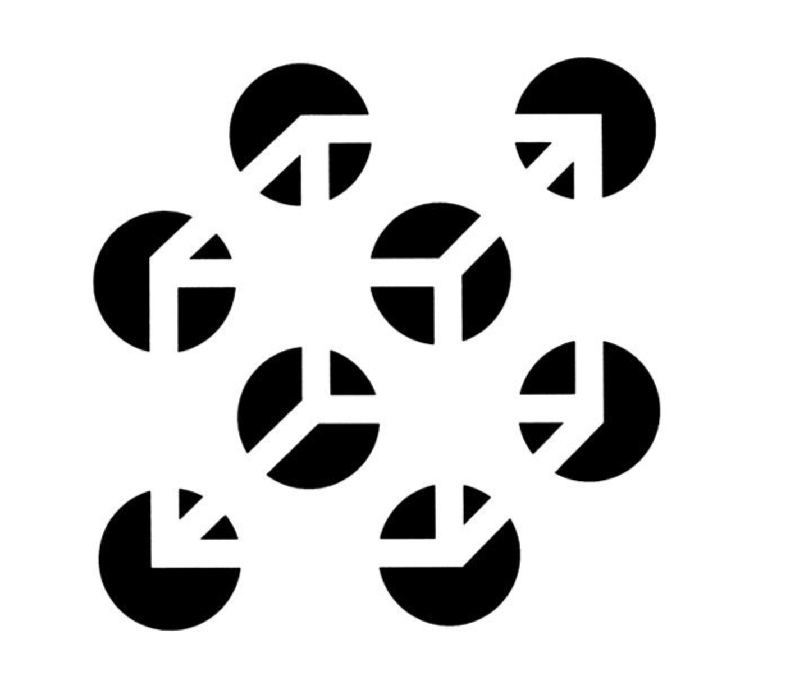
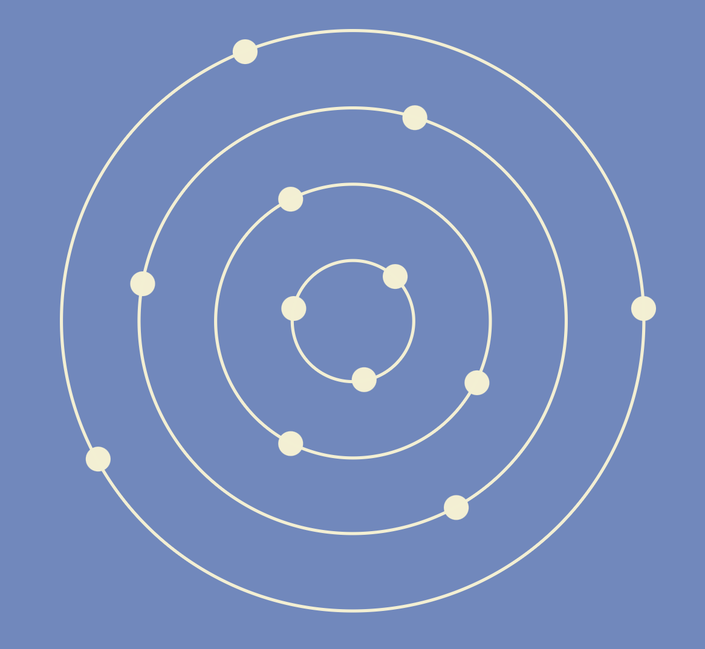

```{r setup, include=FALSE}
knitr::opts_chunk$set(echo = TRUE, tidy = T, error = F, warning = F, message = F)
library(tidyverse)
library(broom)
```

# Cours 2: Introduction à R et à la visualisation (suite) et outils de travail

# Visualisation des données

## Quelques principes généraux de la visualisation des données

- L’humain distingue mieux les différences de tailles quand elles sont organisées sous forme de __lignes__, plutôt que sous forme d’aires, d’angles ou de cercles. 

## En images

{width=70%}

[Source](http://arelbundock.com/acmq.html)

## En images

{width=80%}

[Source](https://socviz.co/lookatdata.html#perception-and-data-visualization)

## En images

{width=52%}

[Source](https://twitter.com/EdwardTufte/status/318216843062034432/photo/1)

## En images

{width=45%}

[Source](https://documentation.sas.com/doc/en/pgmsascdc/v_008/graphref/n11no5qvy87oudn1pn7s64jq7jaf.htm)

## Quelques principes généraux de la visualisation des données (suite)

Notre cerveau peut nous jouer des tours quand on regarde des graphiques ([Healy](https://socviz.co/index.html#preface) 2018). 
- L’oeil humain ne voit pas toutes les __formes, couleurs et contrastes__ aussi efficacement les uns que les autres. 
- Certaines tendances de la cognition peuvent nous permettre de comprendre pourquoi c'est le cas.

## Tendances de la cognition

Healy (et [Arel-Bundock, 2020](http://arelbundock.com/acmq.html)) décrit certaines tendances de la cognition ("Gestalt principles") qui peuvent affecter notre interprétation des éléments visuels:

1. L'oeil fait des liens entre les éléments visuels qui se ressemblent ("similarity"): par exemple, on présume que les éléments de mêmes couleurs, taille ou forme sont liés les uns aux autres.

## Similarity: exemples

{width=50%}

[Source](https://www.usertesting.com/blog/gestalt-principles#similarity)

## Similarity: exemples

{width=40%}

[Source](https://isle.hanover.edu/Ch05Object/Ch05ProxSim_evt.html)

## Tendances de la cognition (suite)

2. L'oeil fait des liens entre les éléments qui sont proche les uns des autres ("proximity"): on a l'impression que les éléments qui sont regroupés ont quelque chose à voir les uns avec les autres.

## Proximity: exemples

{width=70%}

[Source](https://uxmisfit.com/2019/04/23/ui-design-in-practice-gestalt-principles/)

## Proximity: exemples

{width=70%}

[Source](https://www.toptal.com/designers/ui/gestalt-principles-of-design)

## Tendances de la cognition (suite)

3. Les éléments incomplets ou interrompu sont complétés par notre cerveau ("closure", "continuity"): notre cerveau poursuit les lignes qui traversent des "obstacles". Quand une forme est incomplète, notre cerveau la "referme".

## Continuity/Closure: exemples

{width=80%}

[Source](https://www.researchgate.net/figure/Gestalt-Principles-present-how-we-perceive-objects-and-groups-of-objects-Proximity_fig5_36382932)

## Continuity/Closure: exemples

{width=30%}

[Source](https://www.semanticscholar.org/paper/Points-of-View%3A-Gestalt-principles-(Part-2)-Wong/99289115156297560b4e53859f7caddc75016959)

## Continuity/Closure: exemples

{width=60%}

[Source](https://creativemarket.com/blog/the-designers-guide-to-gestalt-psychology)

## Tendances de la cognition (suite)

4. Le cerveau conclut qu'il existe une relation entre les éléments qui sont liés ensemble par l'image ("connection", voir aussi "common region"): en créant des liens entre certains éléments, on donne l'impression qu'ils ont à voir les uns avec les autres.

## Connection/Common region: exemples

{width=45%}

[Source](https://lawsofux.com/law-of-uniform-connectedness/)

## Connection/common region: exemples

{width=60%}

[Source](https://www.usertesting.com/blog/gestalt-principles#proximity)

## Tendances de la cognition (suite)

5. Certains motifs peuvent créer des illusions d’optique.

{width=37%}

[Source](https://www.britannica.com/topic/optical-illusion)

## Tendances de la cognition (suite)

6. L’oeil détecte mieux les contrastes dans les images monochromes (en noir et blanc) que colorées. 

{width=20%}

[Source](https://socviz.co/lookatdata.html#perception-and-data-visualization)

## Tendances de la cognition (suite)

7. Quand le nombre de couleurs augmente, il devient plus difficile de distinguer les informations, surtout si c’est combiné avec des formes variées.

{width=90%}
[Source](https://socviz.co/lookatdata.html#perception-and-data-visualization)

## Les principes de la visualisation

Un des plus grands du domaine de la visualisation des données, Edward Tufte, souligne quatre principes fondamentaux de la visualisation:

1. __Intégrité__: Ne pas être malhonnête avec les données, montrer les données telles qu'elles le sont, avant toute transformation.

## Les principes de la visualisation (suite)

2. __Simplicité__: Réduire la quantité d’encre pour la quantité d’information transmise -- éliminer les décorations, diminuer le nombre de dimensions.

## Les principes de la visualisation (suite)

3. __Contexte__: Ajouter un titre, identifier les axes, identifier les variables et les garder sur des échelles standardisées, ajouter une légende qui décrit bien les élements du graphique.

## Les principes de la visualisation (suite)

4. __Esthétique__: Ultimement, il faut que ce soit beau. Et la beauté est subjective.

## Comment choisir le bon type de graphique?

Il n'y a pas de règles strictes pour choisir le bon type de graphique. Or, il aide de se poser les questions suivantes:

1. __Qui__ est l’audience de notre graphique/de notre article scientifique? 
2. __Quelle histoire__ voulons-nous raconter?
    
## Comment choisir le bon type de graphique? (suite)

3. Quelle est la __nature de nos données__? 
4. Sur quoi avons-nous l'intention de __mettre l'emphase__? 
5. Quel __message__ voulons-nous transmettre à l'aide de notre graphique? 
6. Un __tableau__ serait-il plus approprié pour transmettre l'information?

## Visualiser des données ordonnées

{width=17%}

[Source](https://socviz.co/lookatdata.html#perception-and-data-visualization)

##  Visualiser des données non ordonnées

{width=40%}

[Source](https://socviz.co/lookatdata.html#perception-and-data-visualization)
    
## Différents types de graphiques

Il est possible de suivre certains guides pour s'inspirer, comme:

- [Data-to-Viz](https://www.data-to-viz.com/)
- [The Data Visualisation Catalogue](https://datavizcatalogue.com/)
- [Dataviz Project](https://datavizproject.com/)

## En résumé

- Au final, nos goûts aussi sont importants. 
- Le plus important, comme le dit Tufte, est de ne pas faire mentir les données et de ne pas tenter de transmettre trop d'informations à la fois. 
- Un graphique devrait être intuitif et explicite.

## Quelques maîtres de la visualisation des données

- Je vous encourage à faire vos propres recherches sur les artistes en visualisation des données.
- Je vous montre ici quelques classiques ou personnes que j'apprécie particulièrement. 

## Edward Tufte

Voir le livre.

## Amber Thomas

Voir [ici](https://pudding.cool/2019/03/hype/).

## Le New York Times

Voir [ici](https://www.nytimes.com/interactive/2018/03/27/upshot/make-your-own-mobility-animation.html).

## Information is Beautiful

[ici](https://www.informationisbeautifulawards.com/).

# Pause!

# Suite de l'introduction à R

## Jusqu'à maintenant

1. Nous avons créé des R Projects.
2. Dans ces R Projects, nous avons créé des scripts R, dans lesquelles nous avons rédigé nons commandes.

## Maintenant, on change un peu la formule

1. Les R Projects demeurent.
2. Au lieu de travailler dans des R scripts, nous allons travailler dans des fichiers R Markdown.

## R Markdown: C'est quoi ça?

- R Markdown est un type de fichier (avec extention .Rmd) qui permet de composer du texte _et_ de faire apparaître des commandes R (ainsi que leurs résultats).
- Dans ce type de fichier, le texte est entrecoupé de "bribes" de code R. 
- Lorsqu'on a terminé de composer un document R Markdown, on le "tricotte" dans le format de notre choix, par ex. Word, Powerpoint, PDF ou HTML.
- Dans le cadre du cours, nous nous en tiendrons au format Word. Libre à vous cependant d'explorer les autres formats.

## R Markdown: aperçu

{width=70%}

## Créer un nouveau fichier R Markdown

- Commencez par ouvrir le R Project dans lequel voulez travailler (ou créez-en un nouveau).
- Pour créer un nouveau fichier R Markdown, sélectionnez "File -> New File -> R Markdown..."
- Donnez-lui un titre, cliquez sur le format "Word", puis sur "Ok".
- Lorsque le fichier sera ouvert, enregistrez-le dans votre ordinateur _au même emplacement que votre R Project._

## Les éléments d'un fichier R Markdown

1. Les titres
    - Les titres sont précédés d'un ou plusieurs symbole(s) dièse (#).
    
## Les éléments d'un fichier R Markdown (suite)
    
2. Le texte
    - Le texte est rédigé dans le document. Aucune configuration n'est nécessaire.
    
{width=70%}
    
## Les éléments d'un fichier R Markdown (suite)

3. Les bribes de code

{width=70%}

## Les éléments d'un fichier R Markdown (suite)

3. Les bribes de code
    - Pour créer une nouvelle bribe de code, utilisez le raccourci:
        - Ctrl + Alt + I en Windows
        - Cmd + Option + I en Mac
    - Ou bien: cliquez sur le bouton "Insert" en haut à droite, puis sélectionnez R.
    
## Les éléments d'un fichier R Markdown (suite)

3. Les bribes de code (suite)
    - Dans les bribes de code, on peut écrire des commandes R, exactement comme on faisait dans un R script.
    - Les lignes de codes s'exécutent exactement de la même manière que via un R script.
    - Les résultats apparaissent dans la console (comme avant), _mais aussi_ sous les bribes elles-mêmes. 

## Les éléments d'un fichier R Markdown (suite)

4. La toute première bribe de code
    - Elle est utile si l'on veut ajuster certaines configurations de notre fichier.
    - Pour l'instant, on ne la modifie pas. On ne la supprime pas non plus!
    
{width=70%}

## Comment tricotter un fichier R Markdown

{width=70%}

## Que se passe-t-il quand on tricotte notre fichier?

- Une fois le fichier tricotté, la version Word devrait apparaître.
- Vous la retrouverez aussi à l'emplacement du fichier R Markdown dans votre ordinateur.

## Madame, pourquoi on apprend tout ça?

- Les fichiers R Markdown sont extrêmement utiles pour produire des documents qui contiennent des commandes R _et_ des résultats.
- Pas besoin de copier-coller les résultats de R vers un autre document. 
- Si vous décidez de modifier un élément de votre code, votre document final s'ajustera automatiquement!
- __Dans le cadre du cours, vous remettrez tous vos travaux dans ce format.__
- En plus de voir les résultats que vous produisez, je pourrai aussi voir vos commandes.

## Les paquets

- Jusqu'à maintenant, nous avons utilisé des fonctions qui existent _de facto_ dans R, comme `mean()` ou `read_csv()` par exemple.
- Cependant, la plupart des fonctions doivent être installées, puisqu'elles ne sont pas comprises dans R automatiquement.
- Toutes ces autres fonctions se trouvent dans des "paquets" (_packages_).

## Installer un nouveau paquet

- Pour installer un paquet, on utiliser la fonction `install.packages()`. On ajoute le nom du paquet entre guillemets.

```{r eval=F}
install.packages("tidyverse")
```

- Comment savoir de quel paquet j'ai besoin? Suivre mes instructions ou chercher sur internet!

## "Appeler" un paquet

- Une fois un paquet installé, __vous n'avez plus jamais besoin de le ré-installer!__
- Cependant, à chaquefois que vous ouvrirez R et voudrez utiliser ce paquet, il faudra l'appeler à l'aide de la fonction `library()`.
- Ici, pas besoin de guillemets.

```{r eval = F}
library(tidyverse)
```

## C'est mêlant?

- Pour mieux comprendre, imaginez-vous la chose suivante:
- En utilisant `install.packages()`, c'est comme si vous étiez allé.e acheter un livre (le _package_ en question).
- Vous êtes revenu.e à la maison et l'avez mis dans votre bibliothèque.
- Ensuite, quand vous voulez consulter ce livre, pas besoin de retourner l'acheter, mais vous devez aller le chercher dans votre bibliothèque (`library()`).

## Manipuler des banques de données

- Un paquet extrêmement important pour ce cours est le paquet `tidyverse`.
- Ce paquet est spécial: c'est un paquet qui contient des paquets.
- En l'installant, on installe plein d'autres paquets, donc `dplyr`, qui est très utile pour manipuler les banques de données et `ggplot2`, qui sert à créer des graphiques.

## Le tuyau

- Pour manipuler les banques de données, nous nous servirons d'un outil nommé le "tuyau" (_pipe operator_). 
- Ce dernier prend la forme suivante: `%>%`.
    - Les raccourcis pour l'écrire sont: Ctrl+Shift+M (Windows), Cmd+Shift+M (Mac)
- Quand on veut manipuler une banque de données, on la fait "traverser le tuyau". 
- Tout ça est très étrange, je sais. Les prochaines diapos vous aideront à comprendre.

## Manipuler des banques de données: Sélectionner des variables

- La fonction `select()` permet de sélectionner des variables (colonnes).

```{r tidy = F}
dat = airquality

d = dat %>% 
  select(Wind,Temp)
# on crée un nouvel objet (d) qui contient 
# seulement les variables Wind et Temp
# de la banque de l'bjet original "dat"

d2 = dat %>% 
  select(-Wind) # retirer des variables
```

## Manipuler des banques de données: Sélectionner des lignes

- La fonction `filter()` permet de sélectionner des observations (lignes).

```{r}
d3 = dat %>% 
  filter(Day <= 12) # plus petit ou égal à

d4 = dat  %>% 
  filter(Month == 5) # est égal à

d4 = dat  %>% 
  filter(Solar.R != 99) # n'est pas égal à

d5 = dat  %>% 
  filter(Month > 5,
         Day < 12) 
```

## Manipuler des banques de données: Ajouter des variables

- La fonction `mutate()` permet d'ajouter des variables.

```{r}
dat = dat %>%
  mutate(variable1 = 40) 
# la variable sera égale à 40 pour toutes les observations

dat = dat %>%
  mutate(variable2 = Ozone) 
# dupliquer la variable Ozone
```

## Manipuler des banques de données: Recoder des variables

- La fonction `recode()` permet de recoder une variable existante.
- On peut l'utiliser en combinaison avec `mutate()`.

```{r tidy = F}
dat = CO2 # nouvelle banque
table(dat$Type)

d2 = dat %>% 
  mutate(Type_nouveau = recode(Type, 
                               "Quebec" = "Qc",
                               "Mississippi" = "Miss"))
```

## Manipuler des banques de données: Recoder des variables

- La fonction `ifelse()` est aussi très utile pour recoder des variables.

```{r tidy = F}
d3 = dat %>% 
  mutate(Type_nouveau = ifelse(Type == "Quebec", "Qc", "Miss"))
# si Type est égal à "Quebec", inscrit "Qc".
# Sinon, inscrit "Miss".
```

## Manipuler des banques de données: Modifier le type des variables

- On peut recoder une variable pour changer son type.
- Les fonctions `as.numeric()`, `as.character()`, `as.factor()`, etc. permettent de faire cela.

```{r}
class(dat$conc)

dat = dat %>% 
  mutate(conc = as.character(conc))

class(dat$conc)
```

## Manipuler des variables: Grouper, puis faire des calculs

- La fonction `group_by()` permet de faire groupes.
- Par exemple, on peut vouloir calculer la moyenne d'une variable A pour chacune des catégories d'une variable B.

```{r tidy = F}
table(dat$Treatment) # Treatment a 2 catégories
summary(dat$uptake) # la moyenne globale de uptake est 27.21
```

## Manipuler des variables: Grouper, puis faire des calculs (suite)

```{r tidy = F}
demo = dat %>% 
  group_by(Treatment) %>% 
  summarise(moyenne = mean(uptake)) %>% 
  ungroup()

demo
```

## Manipuler des variables: Grouper, puis faire des calculs (suite)

```{r tidy = F}
demo2 = dat %>% 
  group_by(Treatment) %>% 
  summarise(somme = sum(uptake)) %>% 
  ungroup()

demo2
```

## Exercice 

1. Enregistrez la banque de données `iris`, qui se trouve _de facto_ dans R, dans un objet nommé `banque`. 
2. À l'aide des fonctions `mutate()` et `recode()`, recodez la variable `Species` pour que la catégorie `setosa` se nomme `Setosa`. Enregistrez cette nouvelle banque de données dans un objet nommé `nouvelle_banque`.
3. À l'aide de la fonction `select()`, supprimez la variable `Sepal.Length` de `nouvelle_banque`.
4. Calculez le total de la variable `Petal.Length` pour chaque groupe de la variable `Species`. Appelez ce total `total_petal`.
5. "Tricottez" votre fichier dans un document Word.

## Exercice: Corrigé

1. Enregistrez la banque de données `iris`, qui se trouve _de facto_ dans R, dans un objet nommé `banque`. 

```{r}
banque = iris
banque <- iris
```

## Exercice: Corrigé (suite) 

2. À l'aide des fonctions `mutate()` et `recode()`, recodez la variable `Species` pour que la catégorie `setosa` se nomme `Setosa` et que la catégorie `versicolor` se nomme `Versicolor`. Enregistrez cette nouvelle banque de données dans un objet nommé `nouvelle_banque`.

```{r tidy=F}
table(banque$Species)

nouvelle_banque = banque %>% 
  mutate(Species = recode(Species,
                          "setosa" = "Setosa",
                          "versicolor" = "Versicolor"))
  
```

## Exercice: Corrigé (suite) 

3. À l'aide de la fonction `select()`, supprimez la variable `Sepal.Length` de `nouvelle_banque`.

```{r}
nouvelle_banque = nouvelle_banque %>% 
  select(-Sepal.Length)
```

## Exercice: Corrigé (suite) 

4. Calculez le total de la variable `Petal.Length` pour chaque groupe de la variable `Species`. Appelez ce total `total_petal`.

```{r tidy=F}
nouvelle_banque = nouvelle_banque %>% 
  group_by(Species) %>% 
  summarise(total_petal = sum(Petal.Length)) %>% 
  ungroup()

nouvelle_banque
```

## Exercice: Corrigé (suite) 

5. "Tricottez" votre fichier dans un document Word.

Appuyez sur le bouton "knit".

# À la semaine prochaine!