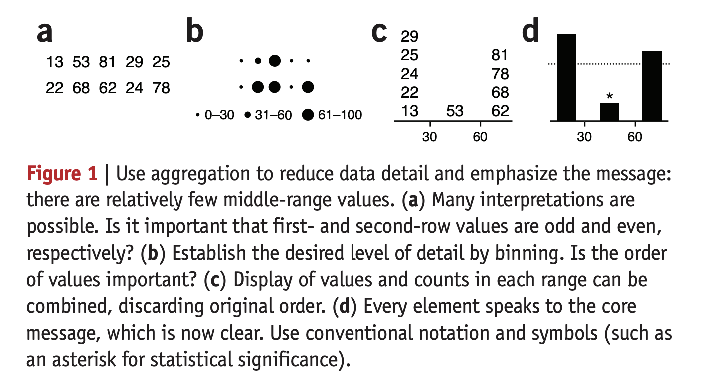

```{r setup, include=FALSE}
knitr::opts_chunk$set(echo = TRUE, tidy = F, error = F, warning = F, message = F)
library(tidyverse)
library(broom)
```

# Cours 3: Graphisme

# Retour sur la semaine dernière

## Deux questions ont été posées

1. Où se situe la littérature sur les visualisations de données 3D?
2. Quel est l'historique de la visualisation des données depuis l'avènement des ordinateurs/du web?

## Graphiques 3D

- Ma compréhension (à la lecture de textes sur la vision): chaque oeil humain voit les images en 2 dimensions, mais chacun avec un angle un peu différent.
- Notre cerveau "assemble" les images pour nous permettre de percevoir la profondeur.
- Vous vous en doutez: Je ne suis ni optométriste ni physicienne de l'optique.

## Graphiques 3D

a. Les graphiques qui présentent des données avec une ou deux dimensions, mais que l'on présente en 3D.
    - Par ex., visualisation d'une ou deux variables.
    - Cela n'apporte généralement pas grand chose, et peut même nuire à la compréhension.
b. Les graphiques qui présentent des données avec trois dimensions ou plus, et que l'on présente en 3D.
    - Par ex., visualisation de trois variables.
    - Cela peut faciliter la lecture des données, mais il y a des pours et des contres.

## Graphiques 3D

a. Les graphiques qui présentent des données avec une ou deux dimensions, mais que l'on présente en 3D.
    - Pour les graphiques à bandes, la perception n'est ni meilleure, ni pire en 3D ou qu'en 2D (Shonlau et Peters 2012).
    - Pour les graphiques en tartes, la perception est pire en 3D (ibid).
    - Si ce n'est pas mieux, alors pourquoi ajouter une profondeur?

## Graphiques 3D

b. Les graphiques qui présentent des données avec trois dimensions ou plus, et que l'on présente en 3D.
    - Pours: peuvent améliorer la compréhension de scènes complexes et la rétention de l'information, mais surtout quand l'information à transmettre est spatiale, quand le niveau de difficulté est plus élevé ou le sujet est moins familier.
    - Contres: peuvent créer de la fatigue visuelle, peuvent créer de la distorsion dans les longueurs (même si le graphique est interactif).
    - Il est souvent possible de représenter les trois dimensions en 2 dimensions.

## L'évolution de la visualisation des données

Voir: Jeffrey Heer, [A brief history of data visualization](https://www.youtube.com/watch?v=N00g9Q9stBo&ab_channel=Stanford), Université Stanford (surtout les minutes 0:00 à 40:00)

## L'évolution de la visualisation des données (suite)

- Pré 17e siècle: beaucoup de cartes.
- 17e siècle: début des visualisations pour transmettre d'information statistique.
- 18e siècle: multiplication des différents sujets, comme la géologie, l'économie, la médecine. Visualisation des fonctions mathématiques, des erreurs de mesures, des données empiriques.
    - graphiques à bandes, à lignes, nuages de points, pointes de tartes, etc.

## L'évolution de la visualisation des données (suite)

- 2e moitié du 19e siècle: l'âge d'or de la visualisation des données. La Révolution industrielle est accompagnée d'une plus grande génération de données (du monde des affaires, des gouvernements, le transport, etc.)
    
## L'évolution de la visualisation des données (suite)

- début du 20e siècle: la grande noirceur de la visualisation. Les mathématiques et les statistiques formelles enlèvent de la crédibilité à la visualisation des données. La visualisation n'est considérée comme assez "fiable".
    - En même temps: le public s'approprie la visualisation des données; de plus en plus de graphiques dans les livres. Essor en psychologie, ce qui nous apporte des fondements cognitifs en visualisation.

## L'évolution de la visualisation des données (suite)

- Fin du 20e siècle: arrivée des ordinateurs, possibilité de traiter les données automatiquement. Réémergence de la visualisation des données. 
- Depuis 1980: multiplication des outils d'analyse et de visualisation.

# Raconter une histoire avec les données

## ''Narrer au lieu de simplement expliquer''

- Raconter une histoire signifie amener un auditoire d'un point A à un point B, en suivant notre propre trame narrative.
- "Inviter l'auditoire à tirer ses propres conclusions est risqué puisque plusieurs histoires peuvent être racontées à partir de la même banque de données." (Martin Krzywinski et Alberto Cairo, Nature Methods, 2013)

{width=40%}

Source: [Krzywinski et Cairo](https://pubmed.ncbi.nlm.nih.gov/24058975/)

## Sujet vs. histoire

- Mettre l'accent sur un aspect précis d'un sujet plus large
- Une histoire est "une série d'observations, de faits, d'événements (réels ou inventés), qui sont présentés dans un ordre spécifique avec pour objectif de provoquer une réaction émotionnelle chez l'auditoire. La réaction émotionnelle résulte de la tension entre le début de l'histoire et son dénouement." ([Wilke](https://clauswilke.com/dataviz/telling-a-story.html))
- Nous nous en tiendrons aux faits réels!

## Comment raconter une histoire

- Différents modèles 
     - Ouverture-Élément déclencheur-Péripéties-Dénouement
     - Ouverture-Développement-Dénouement
     - Action-Mise en contexte-Développement-Point culminant-Dénouement
     - [Wilke](https://clauswilke.com/dataviz/telling-a-story.html)

## Raconter une histoire signifie...

- Vouloir mettre l'accent sur un aspect d'un sujet
- Accrocher l'auditoire avec une question, un élément intriguant, un objectif de clarification, etc.
- Ajouter du contexte dès le tout début
- Suivre une structure: apporter des éléments de réponses, présenter des faits, etc., dans le but de résoudre la question ou clarifier le puzzle 
    - Ces éléments devraient être présentés: visuellement, en mots et en chiffres.
- Avoir en tête son auditoire
- Autres références utiles: [Karthick](https://medium.com/analytics-vidhya/women-business-and-the-law-data-story-telling-using-r-a07c6a8a4fda), [Stikeleather](https://hbr.org/2013/04/how-to-tell-a-story-with-data)

## Raconter une histoire _ne signifie pas_ 

- Présenter _toutes_ les données en lien avec le sujet
- Faire mentir les données ou manquer d'objectivité
- Omettre les nuances
- Multiplier les types de graphiques juste parce qu'on est capable

## Raconter une histoire avec les données: exemples

- [Ben Wellington](https://www.youtube.com/watch?v=6xsvGYIxJok&ab_channel=TEDxTalks)
- [Karen Eber](https://www.youtube.com/watch?v=Ez5yS4Q5ASA&ab_channel=TEDxTalks)
- [Giorgia Lupi](https://www.ted.com/talks/giorgia_lupi_how_we_can_find_ourselves_in_data#t-324674)
- [Jonathan Schwabish](https://vimeo.com/230757062)

# Pause!

# Graphisme

## Roxanne Desrosiers, designer graphique

# À la semaine prochaine!