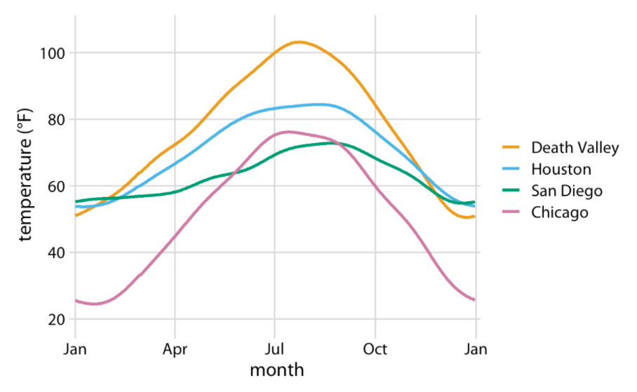
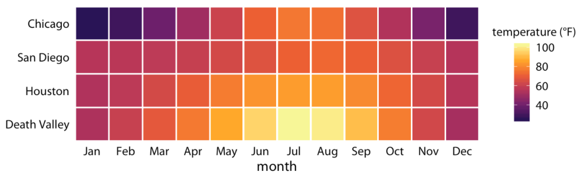
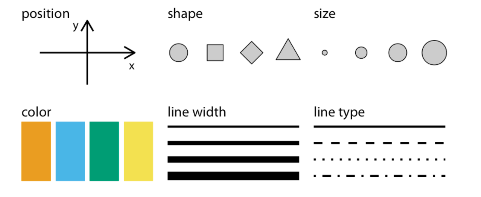
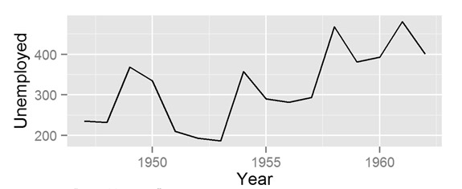
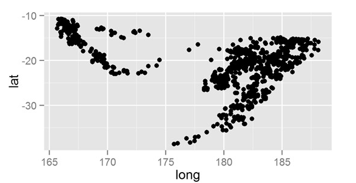
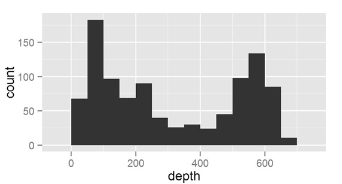

```{r setup, include=FALSE}
knitr::opts_chunk$set(echo = TRUE, tidy = F, error = F, warning = F, message = F)
library(tidyverse)
library(broom)
```

# Cours 4: Les rudiments de la visualisation des données dans `R`

# La logique du graphique

## Les éléments visuels d'un graphique

- Lier une donnée à un élément visuel.
- "Élément visuel" = position (x ou y), forme (des points, par ex.), taille, couleur, épaisseur, type de ligne, etc.
- "Donnée" = une variable dans notre banque de données
- Le choix de l'élément visuel dépend du type de données: variable continue ou catégorielle.

## Les éléments visuels d'un graphique (suite)

{width=70%}

## Les éléments visuels d'un graphique (suite)

{width=70%}

## Les éléments visuels d'un graphique (suite)

{width=70%}

## Les géométries

- Une "géométrie" est ce que l'on appelle communément un type de graphique.
    - nuage de points
    - à barres
    - graphique de densité
    - etc.

## Les géométries (suite)

{width=70%}

## Les géométries (suite)

{width=70%}

## Les géométries (suite)

{width=70%}

# `ggplot()`

## La logique de base de `ggplot()`

`ggplot()` fonctionne par étage.

- Les __données__ sont le 1er étage.
- Les __éléments visuels__ sont le 2e étage.
- Les __géométries__ sont le 3e étage.

## Voyons voir

```{r}
# install.packages("nycflights13")
library(nycflights13)
?flights

dat_echant = flights %>% 
  sample_n(250)

# sélectionner 250 lignes au hasard
```

## La fonction `ggplot()`

```{r}
library(tidyverse)
# library(ggplot2)

?ggplot
```

## La fonction `ggplot()` (suite)

La fonction `ggplot()` permet de lier des données à une représentation graphique. Elle comprend deux élements obligatoires, `data` et `mapping = aes()`. 

```{r eval = F}
ggplot(data = ..., mapping = aes(...))
```

## La fonction `ggplot()` (suite)

1) Dans l'argument `data =`, on spécifie les données d'où proviennent les variables à visualiser.

```{r eval = F}
ggplot(data = donnees, mapping = aes(...))
```

## La fonction `ggplot()` (suite)

2) À l'intérieur de `aes()` (pour "aesthetic"), on spécifie les éléments visuels. Commençons avec des variables qui prendront place sur l'axe des X et des Y. 

```{r eval = F}
ggplot(data = donnees, 
       mapping = aes(x = variableX, y = variableY))
```

Dans cet exemple fictif, `VariableX` se trouvera sur l'axe des X et `VariableY` se trouvera sur l'axe des Y. Ces variables sont dans la banque de données `donnees`.

## À notre tour

Utilisons les données `flights` que nous avons assignées à l'objet `dat_echant`.

```{r fig.width=3, fig.height=3, eval = F}
ggplot(data = dat_echant, 
       mapping = aes(x = dep_delay, y = arr_delay))
```

## Assignons ce graphique à un objet

```{r fig.width=3, fig.height=3}
p <- ggplot(data = dat_echant, 
            mapping = aes(x = dep_delay, y = arr_delay))

p 
```

## Ça donne rien pantoute!

- Vous avez raison.
- Cela s'explique par le fait que nous avons spécifié les données et les éléments visuels (x et y), mais nous n'avons toujours pas spécifié quel _type_ de graphique nous voulions à l'intérieur (la géométrie!). 
- Le `mapping` consistait simplement à lier des données à un graphique.

## Ajouter un `geom`

- La 2e étape est absolument essentielle. 
- Nous ajouterons un type de graphique à notre objet original, à l'aide du symbole `+`. 
- De multiples types de graphiques existent. 
- La plupart commencent par `geom_`, par exemple `geom_point()`, `geom_line()`, `geom_bar()`, `geom_histogram()`, `geom_boxplot()`, etc.

## Ajouter un `geom` (suite)

```{r fig.width=5, fig.height=3}
p1 <- p +
  geom_point()

p1
```

Nous avons donc un graphique avec le délai de départ sur l'axe des X, et délai d'arrivée sur l'axe des Y.

## Exercice 1

1. Liez la variable `carrier` (elle se trouve dans l'objet `dat_echant`) à l'axe des x d'un graphique. Enregistrez le tout dans un objet nommé `p`.
2. Ajoutez un diagramme a barres à l'objet `p`. Nommez ce nouvel objet `p1`.
3. Faites apparaître l'objet `p1`.

## Exercice 1: Corrigé

1. Liez la variable `carrier` (elle se trouve dans l'objet `dat_echant`) à l'axe des x d'un graphique. Enregistrez le tout dans un objet nommé `p`.

```{r}
p = ggplot(data = dat_echant, aes(x = carrier))
```

## Exercice 1: Corrigé

2. Ajoutez un diagramme a barres à l'objet `p`. Nommez ce nouvel objet `p1`.

```{r}
p1 = p + geom_bar()
```

## Exercice 1: Corrigé

3. Faites apparaître l'objet `p1`.

```{r fig.width=3, fig.height=3}
p1
```

# Pause

# `ggplot()` (suite)

## Spécifier des couleurs, des formes, etc.

Rappelez-vous: 

{width=70%}


## Spécifier des couleurs, des formes, etc. (suite)

Je voudrais colorer les points en bleu.

## Spécifier des couleurs, des formes, etc. (suite)

```{r fig.width=5, fig.height=3}
ggplot(data = dat_echant, 
       mapping = aes(x = dep_delay, y = arr_delay, color = "blue")) +
  geom_point()
```

##  Spécifier des couleurs, des formes, etc. (suite)

Pourquoi c'est rouge?!

```{r fig.width=5, fig.height=3}
ggplot(data = dat_echant, 
       mapping = aes(x = dep_delay, y = arr_delay, color = "blue")) +
  geom_point()
```

## Prise 2

```{r fig.width=5, fig.height=3}
ggplot(data = dat_echant, 
       mapping = aes(x = dep_delay, y = arr_delay)) +
  geom_point(color = "blue")
```

##  Spécifier des couleurs, des formes, etc. (suite)

```{r fig.width=5, fig.height=3}
ggplot(data = dat_echant, 
       mapping = aes(x = dep_delay, y = arr_delay)) +
  geom_point(shape = "triangle")
```

## Parenthèse

Remarquez comment j'ai fait tout le graphique "d'un coup" en ajoutant `geom_point()` directement à `ggplot`.

## Modifier l'apparence d'éléments visuels en fonction d'autres variables 

- En plus de spécifier les variables qui se trouvent sur l'axe des X et des Y, `aes()` sert à __faire varier__ les éléments de la représentation visuelle, comme la couleur, la forme, la taille et l'opacité des éléments qui se trouvent dans le graphique. 

## Manipuler l'`aes`

Encore une fois, rappelez-vous: 

{width=70%}

## Manipuler l'`aes` (suite)

Ici, je veux colorer les points en fonction du mois auquel ils correspondent.

```{r fig.width=5, fig.height=3}
ggplot(data = dat_echant, 
       mapping = aes(x = dep_delay, y = arr_delay, color = month)) +
  geom_point()
```

## Manipuler l'`aes` (suite)

- La variable `month` est numérique, donc sa couleur prend l'apparence d'un dégradé.
- Or, il semble plus logique de se représenter les mois comme des catégories. 

```{r fig.width=5, fig.height=3}
ggplot(data = dat_echant, 
       mapping = aes(x = dep_delay, y = arr_delay, 
                     color = as.factor(month))) +
  geom_point()
```

## La flexibilité d'`aes` 

- On peut modifier d'autres éléments, comme le type de lignes (`linetype`), la couleur de remplissage (`fill`), l'opacité (`alpha`), la taille (`size`), la forme des points (`shape`), etc.
- Attention, certains éléments visuels ne peuvent être modifiés s'ils ne correspondent pas à la géométrie choisie.
- Ex: ici, on ne peut pas modifier le type de ligne puisque notre graphique ne comporte pas de ligne.

## La flexibilité d'`aes` (suite)

```{r fig.width=5, fig.height=3}
ggplot(data = dat_echant, 
       mapping = aes(x = distance, y = air_time, 
                     shape = origin)) +
  geom_point()
```

## La flexibilité d'`aes` (suite)

Autre exemple.

```{r fig.width=5, fig.height=3}
ggplot(data = dat_echant, 
       mapping = aes(x = as.factor(month))) +
  geom_bar()
```

## La flexibilité d'`aes` (suite)

```{r fig.width=5, fig.height=3}
ggplot(data = dat_echant, 
       mapping = aes(x = as.factor(month), 
                     fill = as.factor(origin))) +
  geom_bar()
```

## Différence entre `color` et `fill`

```{r fig.width=5, fig.height=3}
ggplot(data = dat_echant, 
       mapping = aes(x = as.factor(month), group = origin, 
                     color = as.factor(origin))) +
  geom_bar()
```

## Exercice 2

1. À partir des données `dat_echant`, créez un graphique à ligne mettant en relation les variables `arr_delay` (y) et `dep_delay` (x). 
2. Colorez la ligne en rouge (`red`).
3. Colorez la ligne en fonction de la variable `month`. Utilisez `month` de façon à ce que la variable soit catégorielle.

## Exercice 2: Corrigé

1. À partir des données `dat_echant`, créez un graphique à ligne mettant en relation les variables `arr_delay` (y) et `dep_delay` (x). 

```{r fig.width=5, fig.height=3}
ggplot(data = dat_echant, aes(x = dep_delay, y = arr_delay)) +
  geom_line()
```

## Exercice 2: Corrigé

2. Colorez la ligne en rouge (`red`).

```{r fig.width=5, fig.height=3}
ggplot(data = dat_echant, aes(x = dep_delay, y = arr_delay)) +
  geom_line(color = "red")
```

## Exercice 2: Corrigé

3. Colorez la ligne en fonction de la variable `month`. Utilisez `month` de façon à ce que la variable soit catégorielle.

```{r fig.width=5, fig.height=3}
ggplot(data = dat_echant, aes(x = dep_delay, y = arr_delay, 
                              color = as.factor(month))) +
  geom_line()
``` 

## Ajouter plus d'un `geom`

Il est possible d'ajouter plus d'une géométrie à un graphique.

```{r fig.width=5, fig.height=3}
ggplot(data = dat_echant, 
       mapping = aes(x = dep_delay, y = arr_delay)) +
  geom_point() +
  geom_line()
```

## Ajouter plus d'un `geom` (suite)

```{r fig.width=5, fig.height=3}
ggplot(data = dat_echant, 
       mapping = aes(x = dep_delay, y = arr_delay)) +
  geom_point() +
  geom_smooth()
```

## Ajouter plus d'un `geom` (suite)

```{r fig.width=5, fig.height=3}
?geom_smooth()
```

## Modifier les différents `geom`

Avoir plus d'un `geom` signifie qu'il est possible de modifier chaque `geom` indépendemment l'un de l'autre.

```{r fig.width=5, fig.height=3}
ggplot(data = dat_echant, 
       mapping = aes(x = dep_delay, y = arr_delay, color = origin)) +
  geom_point() +
  geom_line()
```

## Modifier les différents `geom` (suite)

```{r fig.width=5, fig.height=3}
ggplot(data = dat_echant, 
       mapping = aes(x = dep_delay, y = arr_delay)) +
  geom_point(mapping = aes(color = origin)) +
  geom_line()
```

## Modifier les différents `geom` (suite)

```{r fig.width=5, fig.height=3}
ggplot(data = dat_echant, 
       mapping = aes(x = dep_delay, y = arr_delay)) +
  geom_point() +
  geom_line(mapping = aes(color = origin))
```

## Exercice 3

1. Toujours à partir des données `dat_echant`, créez un graphique avec la variable `dep_delay` sur l'axe des x et la variable `arr_delay` sur l'axe des y. Enregistrez le tout dans un objet nommé `p`.
2. Ajoutez un graphique à points et une ligne de régression (`geom_smooth`) à `p`. La forme (`shape`) des points doit varier en fonction de la variable `origin`. Enregistrez le tout dans un objet nommé `p1`. Faites apparaître l'objet `p1`.
3. Ajoutez un graphique à points et une ligne de régression (`geom_smooth`) à `p`. La couleur des lignes doit varier en fonction de la variable `origin`. Enregistrez le tout dans un objet nommé `p2`. Faites apparaître l'objet `p2`.

## Exercice 3: Corrigé

1. Toujours à partir des données `dat_echant`, créez un graphique avec la variable `dep_delay` sur l'axe des x et la variable `arr_delay` sur l'axe des y. Enregistrez le tout dans un objet nommé `p`.

```{r}
p = ggplot(data = dat_echant, 
       mapping = aes(x = dep_delay, y = arr_delay)) 
```

## Exercice 3: Corrigé

2. Ajoutez un graphique à points et une ligne de régression (`geom_smooth`) à `p`. La forme (`shape`) des points doit varier en fonction de la variable `origin`. Enregistrez le tout dans un objet nommé `p1`. Faites apparaître l'objet `p1`.

```{r fig.width=5, fig.height=3}
p1 = p +
  geom_point(mapping = aes(shape = origin)) +
  geom_smooth()

p1
```

## Exercice 3: Corrigé

3. Ajoutez un graphique à points et une ligne de régression (`geom_smooth`) à `p`. La couleur des lignes doit varier en fonction de la variable `origin`. Enregistrez le tout dans un objet nommé `p2`. Faites apparaître l'objet `p2`.

```{r fig.width=5, fig.height=3}
p2 = p +
  geom_point() +
  geom_smooth(mapping = aes(color = origin))

p2
```


## Quelques mots pour conclure

- Pour l'instant, les graphiques que nous avons faits ne sont pas très utiles (et même un peu hideux!). 
- Ne vous inquiétez pas, les prochains cours exposeront toute la puissance et la flexibilité de `ggplot`!
- Parenthèse: Ne faites pas comme moi, évitez de nommer vos graphiques _p1_, _p2_, _p3_, etc.

# Temps libre pour compléter le mini TP 3

# À la semaine prochaine!