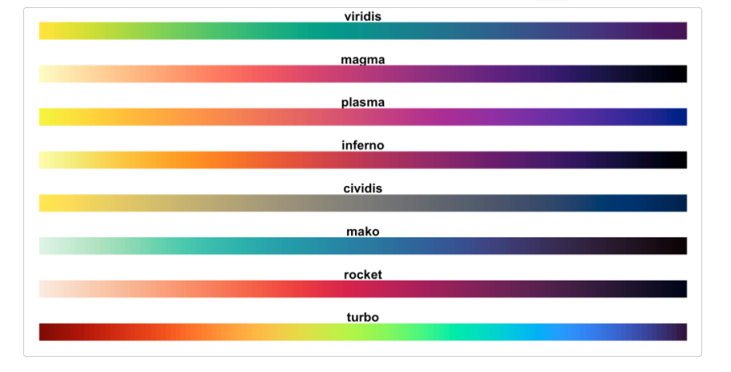

```{r setup, include=FALSE}
knitr::opts_chunk$set(echo = TRUE, tidy = F, error = F, warning = F, message = F, fig.width = 5, fig.height = 3)
library(tidyverse)
library(broom)
```

# Cours 5: Les rudiments (suite) et les graphiques univariés

# La logique du graphique

## Les étages

1. les données (`data = ...`)
2. les éléments visuels (`mapping = aes(...)`)
3. les géométries (`geom_`)
4. __l'apparence des éléments visuels (`scale_`)__
5. __les étiquettes (`labs(...)`)__

## `scale_`

- Après avoir déterminé nos `geom`, on peut ensuite modifier l'apparence du graphique. 
- `scale_`permet de modifier les éléments qui se trouvent dans l'`aes`. Cela inclut les coordonnées (x et y), mais aussi tout ce qui se rapporte aux couleurs, formes, etc. 

## On repart

```{r}
# install.packages("gapminder")
library(gapminder)

dat <- gapminder
```

## Les 3 premiers étages

```{r}
p = ggplot(aes(x = gdpPercap, y = lifeExp), data = dat) +
  geom_point()

p
```

## Étage 4: `scale_`

- `scale_x_continuous()`
- `scale_y_discrete()`
- `scale_fill_continuous()`
- `scale_color_discrete()`
- etc.

## `scale_`

Notre variable X est numérique continue.

```{r}
p1 = p +
  scale_x_continuous(name = "PIB par habitant")

p1
```

## `scale_`

- `name = ...,`
- ` breaks = ...,`
-  `labels = ...,`
-  `limits = ...`
- et plusieurs autres

## `scale_`

```{r}
p2 = p +
  scale_x_continuous(name = "PIB par habitant",
                     # pour  changer les valeurs des coupures
                     breaks = c(0,25000,50000,75000,100000))

p2
```

## `scale_`

```{r}
p3 = p +
  scale_x_continuous(name = "PIB par habitant",
                     # pour  changer les valeurs des coupures
                     breaks = c(0,25000,50000,75000,100000),
                     # pour changer les noms associés aux coupures
                     labels = c("0", "25 000$", "50 000$", 
                                "75 000$", "100 000$"))

p3
```

## `scale_`

```{r}
p4 = p +
  scale_x_continuous(name = "PIB par habitant",
                     # pour  changer les valeurs des coupures
                     breaks = c(0,25000,50000,75000,100000),
                     # pour changer les noms associés aux coupures
                     labels = c("0", "25 000$", "50 000$", 
                                "75 000$", "100 000$"),
                     # pour limiter les valeurs sur l'axe des X
                     limits = c(0,30000))

p4
```

## Tout en même temps

```{r eval =  F}
p5 = ggplot(aes(x = gdpPercap, y = lifeExp), data = dat) +
  geom_point() +
  scale_x_continuous(name = "PIB par habitant",
                     # pour changer les valeurs des coupures
                     breaks = c(0,25000,50000,75000,100000),
                     # pour changer les noms associés aux coupures
                     labels = c("0", "25 000$", "50 000$", 
                                "75 000$", "100 000$"),
                     # pour limiter les valeurs sur l'axe des X
                     limits = c(0,30000))

p5
```

## `scale_`

- `scale_x_continuous()`: variable continue (_numeric_, _integer_)
- `scale_x_discrete()`: variable catégorielle (_character_, _factor_)

## Exemple

```{r eval = F}
dat2 = dat %>% 
  mutate(year = as.factor(year))

ggplot(aes(x = year, y = lifeExp), data = dat2) +
  geom_point() +
  scale_x_continuous(name = "Année")
```

## Exercice 1

1. Liez la variable `continent` (elle se trouve dans l'objet `dat`) à l'axe des x d'un graphique. Ajoutez un diagramme a barres. Enregistrez le tout dans un objet nommé `graph`. Faites apparaître l'objet `graph`.
2. À partir de l'objet `graph`, renommez l'axe des x "Continent" (avec un c majuscule) et l'axe des y "Nombre". Nommez ce nouvel objet `graph1`. Faites apparaître l'objet `graph1`.
3. À partir de l'objet `graph`, changez l'ordre des catégories sur l'axe des x. La catégorie `Americas` devrait arriver en premier (l'ordre des autres catégories ne change pas). Nommez ce nouvel objet `graph2`. Faites apparaître l'objet `graph2`.

## Exercice 1 (correction)

```{r}
graph = ggplot(data = dat, aes(x = continent)) +
  geom_bar()

graph
```

## Exercice 1 (correction)

```{r}
graph1 = graph +
  scale_x_discrete(name = "Continent") +
  scale_y_continuous(name = "Nombre")

graph1
```

## Exercice 1 (correction)

```{r}
graph2 = graph +
  scale_x_discrete(limits = c("Americas", "Africa", "Asia", "Europe", "Oceania")) 

graph2
```

## Exercice 1 (correction)

- Comme vous avez pu le remarquer, `limits` permet de spécifier les différents coupures (dans le cas d'un axe continu) ou de _changer l'ordre_ des coupures (dans le cas d'un axe catégoriel).
- `?scale_x_discrete`
- Ne pas confondre avec `labels`! Cela crée un graphique erroné!

```{r}
graph +
  scale_x_discrete(labels = c("Americas", "Africa", "Asia", "Europe", "Oceania")) 
```

## `scale_`

- N'oubliez pas qu'il est possible d'utiliser `scale_` pour faire d'autres modifications. `name`, `breaks`, `labels`, `limits` sont des  arguments très communs, mais ils ne sont pas les seuls!
- Pour l'instant, nous avons seulement modifié l'apparence de l'axe des x et de l'axe des y, mais d'autres éléments peuvent se trouver dans l'`aes` (color, shape, linetype, etc.)

## `scale_`

```{r}
p = ggplot(aes(x = gdpPercap, y = lifeExp, color = continent), 
           data = dat) +
  geom_point() +
  scale_x_continuous(limits = c(0,20000))

p
```

## `scale_`

```{r}
p7 = p +
  scale_color_discrete(name = "Continent")

p7
```

## `scale_`

```{r}
p8 = p +
  scale_color_discrete(name = "Continent",
                       # changer l'ordre des catégories
                       limits = c("Americas", "Africa", "Asia", 
                                  "Europe", "Oceania")) 

p8
```

## `scale_`

```{r}
p9 = p +
  scale_color_discrete(name = "Continent",
                       # changer l'ordre des catégories
                       limits = c("Americas", "Africa", "Asia", 
                                  "Europe", "Oceania"),
                       # changer les étiquettes des catégories
                       labels = c("Amériques", "Afrique", "Asie", 
                                  "Europe", "Océanie")) 

p9
```

## `scale_`

- Même principe: `scale_color_discrete` ou `scale_color_continuous`
- Le fonctionnement est le même pour: `scale_fill_discrete` ou `scale_fill_continuous`
- Le fonctionnement est le même pour: `scale_linetype_...`, `scale_shape_...`, etc.

## Exercice 2

1. Liez la variable `continent` à l'axe des x et la variable `gdpPercap` à l'axe des y. Ajoutez un nuage de points. Colorez les points en fonction de la variable `lifeExp`. Enregistrez le tout dans un objet nommé `graph`. Faites apparaître l'objet `graph`.
2. Renommez toutes les étiquettes de variables avec des noms français. Nommez ce nouvel objet `graph1`. Faites apparaître l'objet `graph1`.
3. À partir de l'objet `graph`, limitez la légende aux âges qui se situent entre 60 et 80 ans. Nommez ce nouvel objet `graph2`. Faites apparaître l'objet `graph2`.

## Exercice 2 (correction)

```{r}
graph = ggplot(data = dat, 
               aes(x = continent, y = gdpPercap, color = lifeExp)) +
  geom_point()

graph
```

## Exercice 2 (correction)

```{r}
graph1 = graph +
  scale_y_continuous(name = "PIB/hab.") +
  scale_x_discrete(name = "Continent",
                   labels = c("Afrique", "Amériques", "Asie",
                              "Europe", "Océanie")) +
  scale_color_continuous(name = "Espérance de vie")

graph1
```

## Exercice 2 (correction)

```{r}
graph2 = graph +
  scale_color_continuous(limits = c(60,80))

graph2
```

## Exercice 2 (correction)

- Notez qu'en limitant la légende à l'aide de `scale_color_continuous()`, nous n'avons supprimé aucun point. 
- Si nous avions voulu retirer certains points, il aurait fallu filtrer notre banque de données.

```{r}
exemple = dat %>% 
  filter(lifeExp >= 60 & lifeExp <= 80)

# ensuite, faire le graphique
```

## `scale_`: les choix de couleurs

- Plusieurs palettes de couleurs existent dans `R`.
- Pour les utiliser, il faut souvent installer des `packages`.

## RColorBrewer

{width=70%}

https://ggplot2.tidyverse.org/reference/scale_brewer.html

## Viridis

{width=70%}

https://cran.r-project.org/web/packages/viridis/vignettes/intro-to-viridis.html

## Inauguration

{width=70%}

https://github.com/ciannabp/inauguration

## Wes Anderson

{width=70%}

https://github.com/karthik/wesanderson

## Et plusieurs autres!

- Je vous recommande d'explorer le web pour trouver des palettes que vous aimez.

## Choix manuels de couleurs

- `scale_color_manual()` et `scale_fill_manual()` permettent de changer les couleurs manuellement.

```{r}
ggplot(data = dat, 
       aes(y = lifeExp, x = gdpPercap, color = continent)) +
  geom_point() +
  scale_color_manual(values = c("orange", "blue", "black", 
                                "red", "green"))
  
```

## Choix manuels de couleurs

- On peut sélectionner les couleurs par leur nom, leur code RGP, leur code HEX ou leur numéro.
- https://www.r-graph-gallery.com/ggplot2-color.html
- Attention aux mauvais agencements et aux mauvais contrastes!

## Choix manuels de types de lignes

```{r}
ggplot(data = dat, 
       aes(y = lifeExp, x = gdpPercap, linetype = continent)) +
  geom_smooth() +
  scale_x_continuous(limits = c(0,20000)) +
  scale_linetype_manual(values = c("solid", "twodash", "dotted", 
                                "dotdash", "dashed"))
  
```

## Choix manuels de types de lignes

- http://www.sthda.com/french/wiki/ggplot2-type-de-traits-comment-changer-le-type-de-trait-d-un-graphique-avec-le-logiciel-r
- Attention de ne pas trop multiplier le nombre de lignes!

## Choix manuels de types de formes de points

```{r}
ggplot(data = dat, 
       aes(y = lifeExp, x = gdpPercap, shape = continent)) +
  geom_point() +
  scale_shape_manual(values = c(0,1,5,3,6))
  
```

## Choix manuels de types de formes de points

- http://www.sthda.com/french/wiki/ggplot2-types-de-points-logiciel-r-et-visualisation-de-donnees
- Attention, les petits points sont difficiles à différencier!

## Étage 5: `labs()`

- `labs` permet d'ajouter et de modifier les titres, sous-titres, titres des axes et notes de bas de graphique.

```{r, message = FALSE}
ggplot(data = dat, aes(x = continent)) +
  geom_bar() +
  labs(title = "Nombre d'observations pour chaque continent",
       subtitle = "Données gapminder",
       x = "Continent",
       y = "Nombre d'observations",
       caption = "Graphique par Florence Vallée-Dubois")

```

## `labs()`

- Oui, il est possible de changer le titre des axes en utilisant `labs()` ou en utilisant `scale_`

# Les graphiques univariés (une seule variable à visualiser)

- graphiques à bandes/barres (`geom_bar()`)
- histogrammes (`geom_histogram()`)
- graphiques de densité (`geom_density()`)

## Différence entre un graphique à bandes/barres et un histogramme?

- Histogramme: pour montrer la distribution d'une variable continue
- Graphique à barres/bandes: comparer des catégories

## Différence entre un graphique à bandes/barres et un histogramme?

```{r}
ggplot(data = dat, aes(x = continent))+
  geom_bar()
```

## Différence entre un graphique à bandes/barres et un histogramme?

```{r}
ggplot(data = dat, aes(x = lifeExp))+
  geom_histogram()
```

## Comment faire apparaître le pourcentage au lieu du nombre?

- Le pourcentage d'observations de chaque continent.
- Réorganisons les données.

```{r}
d = dat %>% 
  group_by(continent) %>% 
  summarise(nombre = n()) %>% 
  ungroup() %>% 
  mutate(pourcentage = nombre/sum(nombre)*100)
```

## Comment faire apparaître le pourcentage au lieu du nombre?

```{r}
ggplot(data = d, aes(x = continent, y = pourcentage)) +
  geom_bar(stat = "identity")
```

## Pourquoi `stat = "identity"`? 

- Parce que `geom_bar()` agrège les données par défaut. 
- `stat = "identity"` le force à ne pas le faire.

## Alternative: `geom_col()`

```{r}
ggplot(data = d, aes(x = continent, y = pourcentage)) +
  geom_col()
```

- `geom_col()` n'agrège pas les données par défaut. 

## Graphiques de densité

- Des histogrammes "lisses".
- Par défaut, l'axe des y donne l'aire sous la courbe.

```{r}
ggplot(data = dat, aes(x = lifeExp))+
  geom_density()
```

## Exercice 3

1. Créez un graphique de densité pour montrer la distribution de la variable `gdpPercap`. Remplissez le/les densité(s) en fonction du continent. Spécifiez l'opacité (`alpha`) de la/des courbes à 0.4. Enregistrez le tout dans un objet nommé `p`.
2. Restreignez l'axe des x à un maximum de 20 000$/hab. Enregistrez le tout dans un objet nommé `p1`. Faites apparaître l'objet `p1`.
3. Ajoutez un titre, un sous-titre et des titres pour les axes. Nommez ce nouvel objet `p2`. Faites apparaître l'objet `p2`.

## Exercice 3 (correction)

```{r}
p = ggplot(data = dat, aes(x = gdpPercap, fill = continent)) +
  geom_density(alpha = .4)

p
```

## Exercice 3 (correction)

```{r}
p1 = p +
  scale_x_continuous(limits = c(0,20000))

p1
```

## Exercice 3 (correction)

```{r}
p2 = p1 +
  labs(title = "PIB par habitant, par continent",
       subtitle = "Distributions limitées à 20 000$/hab.",
       x ="PIB/hab. (en $)",
       y =  "Densité")

p2
```


## Quelques mots pour conclure

- Ne faites pas comme moi: n'utilisez pas p1, p2, p3, etc. pour nommer vos graphiques.
- La semaine prochaine: Comment modifier ce qui ne touche pas à l'`aes` (l'arrière-plan, l'alignement, etc.)

# Temps libre pour compléter l'Exercice de visualisation

# À la semaine prochaine!