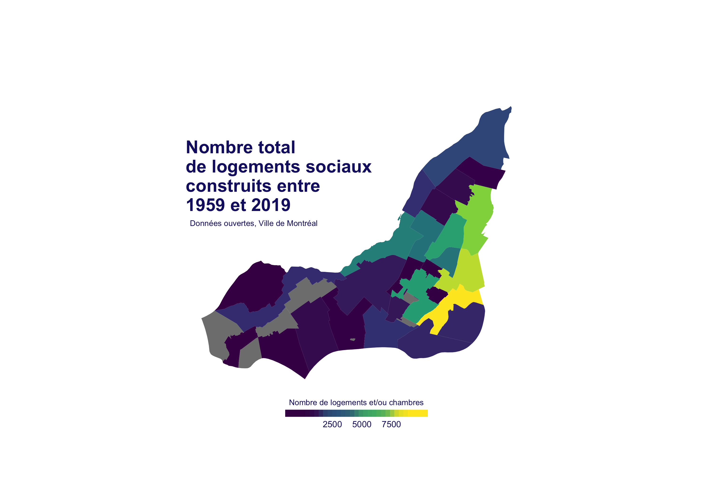

```{r setup, include=FALSE}
knitr::opts_chunk$set(echo = TRUE, tidy = F, error = F, warning = F, message = F, fig.width = 5, fig.height = 3)
```

# Cours 9: Cartes

## Plan de match

1. Logique générale des données géospatiales
2. On fait des cartes!
3. Cartes interactives
4. Autres packages pour les cartes
5. Nouvelles fonctions

## Packages nécessaires

```{r}
library(tidyverse)
library(rgdal)
library(rmapshaper)
library(sp)
library(leaflet)
library(broom)
library(maps)
library(mapcan)
```

# Logique générale des données géospatiales
## Données géospatiales

- Longitude: Positionnement est-ouest
- Latitude: Positionnement nord-sud
- Indiquent où se trouve un point à la surface de la Terre.

## Données géospatiales

{width=60%}

## Données géospatiales

- La terre est ronde, mais nous représentons les cartes en 2D. 

{width=60%}

## Données géospatiales

- Système de coordonnées (Coordinate Reference System ou CRS): système utilisé pour transformer des coordonnées sphériques en coordonnées deux-dimensionnelles.

{width=60%}

Source: https://www.earthdatascience.org/courses/earth-analytics/spatial-data-r/intro-to-coordinate-reference-systems/

## Données géospatiales

{width=60%}

- tiré de Healy (2017)

## Données de type shapefile

- Un shapefile (fichier de formes) contient plusieurs fichiers (.shx, .dbf, .shp, etc.)
- Contient:
    - le positionnement géospatial des différents polygones ou points
    - l'index de la géométrie
    - des métadonnées 

## Les données géospatiales de Montréal

```{r}
# https://donnees.montreal.ca/ville-de-montreal/polygones-arrondissements
```

# On fait des cartes!
## Une remerciement tout particulier

- Les notes d'Andrew McCormack: https://mccormackandrew.github.io/geoviz_workshop/
- Les notes de Kieran Healy: https://socviz.co/maps.html#maps

## Ouvrir les données

```{r}
montreal <- readOGR(dsn = "montreal", # dossier
                    layer = "LIMADMIN") 

# 34 features: 34 polygones, soit 34 arrondissements 
# et villes liées

# 9 fields: 9 variables
```

## Nos données

```{r}
summary(montreal)

# SpatialPolygonsDataFrame
# x min, x max, ymin, ymax
# infos sur la projection
```

## Nos données

```{r}
# View(montreal)
```

## Accéder à un élément dans nos données

```{r}
# un élément de la liste
summary(montreal@data)
```

## Accéder à un élément dans nos données

```{r}
# un élément dans un élément de la liste
summary(montreal@data$MUNID)
```

## Parenthèse sur les polygones

```{r}
# Les coordonées de chaque polygone 
# sont bien cachées
montreal@polygons[[4]]@Polygons[[1]]@coords 

# Pourquoi autant de coordonnées?
```

## Première carte

```{r}
plot(montreal)
```

## Réduire le nombre de points

```{r}
montreal_n <- ms_simplify(input = montreal, 
                          # % à garder
                          keep = 0.2, 
                          # ne pas supprimer de polygones
                          keep_shapes = TRUE) 

# Surtout utile quand vous avez de
# très grandes cartes
```

## 2e carte

```{r}
plot(montreal_n)
```

## Transformer en tableau de données

```{r}
montreal_table <- tidy(x = montreal_n,
                       region = "NOM") 

# On spécifie la "region", soit le polygone
# associé à chaque série de coordonnées
```

## Explorer le tableau

```{r}
head(montreal_table)
```

## Ramener les variables perdues en chemin

```{r}
montreal_table <- right_join(montreal_table,
                             montreal_n@data,
                             by = c("id" = "NOM"))
# on spécifie par quelle variable lier le tout
# à ce point-ci, on pourrait joindre d'autres données!
```

## 3e carte: `ggplot` à la rescousse!

```{r}
# x est la longitude
# y est la latitude

ggplot(data = montreal_table,
       aes(x = long,
           y = lat, 
           group = group)) +
  geom_polygon()
```

## Modifier les coordonnées

```{r}
# pour donner une apparence plus
# réaliste à la carte
ggplot(data = montreal_table,
       aes(x = long,
           y = lat, 
           group = group)) +
  geom_polygon() +
  coord_map() 
```

## Retirer le superflu

```{r}
ggplot(data = montreal_table,
       aes(x = long,
           y = lat, 
           group = group)) +
  geom_polygon() +
  coord_map() +
  theme_void()
```

## Modifier l'aspect en fonction d'une variable

```{r}
ggplot(data = montreal_table,
       aes(x = long,
           y = lat, 
           group = group,
           fill = TYPE)) +
  geom_polygon(color = "white", 
               size = .2) +
  coord_map() +
  theme_void()
```

## Joindre d'autres informations

```{r}
# logements sociaux
logements = read.csv("files/logements_sociaux.csv")
head(logements)
```

## Joindre d'autres informations

```{r}
# recoder l'emplacement
logements = logements %>% 
  mutate(villelie = as.character(villelie),
         arrond = as.character(arrond),
         arrond_ville = ifelse(arrond == "", 
                               villelie, 
                               arrond))

```

## Joindre d'autres informations

```{r}
# calculer le total par arrond.
logements_mod = logements %>%
  group_by(arrond_ville) %>% 
  mutate(somme_log = sum(nb_log, na.rm = T)) %>% 
  ungroup() %>% 
  distinct(arrond_ville, somme_log)
```

## Joindre d'autres informations

```{r}
list(logements_mod$arrond_ville)
```

## Joindre d'autres informations

```{r}
list(unique(montreal_table$id))
```

## Joindre d'autres informations

```{r}
# recoder l'emplacement (encore)
logements_mod = logements_mod %>% 
  mutate(arrond_ville = 
           str_replace_all(arrond_ville, "–", "-"))
```

## Joindre d'autres informations

```{r}
# joindre les deux banques
dat = right_join(logements_mod, montreal_table,
                 by = c("arrond_ville" = "id"))
```

## Joindre d'autres informations: faire la carte

{width=60%}

## Joindre d'autres informations: faire la carte

```{r eval = F}
p = ggplot(data = dat,
       aes(x = long,
           y = lat, 
           group = group,
           fill = somme_log)) +
  geom_polygon() +
  scale_fill_viridis_c(name = "Nombre de logements et/ou chambres",
                       breaks = c(0,2500,5000,7500,10000),
                       guide = guide_colorbar(title.position = "top",
                                              title.hjust = .5,
                                              ticks = F,
                                              nbin = 4,
                                              barheight = .5,
                                              barwidth = 10)) +
  labs(title = "Nombre total\nde logements sociaux\nconstruits entre\n1959 et 2019",
       subtitle = "Données ouvertes, Ville de Montréal") +
  coord_map()
```

## Joindre d'autres informations: faire la carte (suite)

```{r eval = F}
p + theme_void() +
  theme(legend.position = "bottom",
        plot.title = element_text(vjust = -35,
                                  size = 18,
                                  face = "bold",
                                  color = "midnightblue"),
        plot.subtitle = element_text(vjust = -80,
                                     hjust = .02,
                                     size = 8,
                                     color = "midnightblue"),
        plot.margin = margin(0,1,2.5,1,"cm"),
        legend.title = element_text(size = 8,
                                    color = "midnightblue"),
        legend.text = element_text(color = "midnightblue"))
```

## Inclure des points à l'intérieur des polygones

```{r}
head(logements$longitude)
head(logements$latitude)
```

## Inclure des points à l'intérieur des polygones

{width=60%}

## Inclure des points à l'intérieur des polygones

```{r eval = F}
p = ggplot() +
  geom_polygon(data = dat,
               aes(x = long,
                   y = lat, 
                   group = group),
               fill = "ivory2",
               color = "grey10") +
  geom_point(data = logements, 
             aes(x = longitude,
                 y = latitude,
                 color = projettype),
             size = .9,
             alpha = .8) +
  scale_color_brewer(name =  "",
                     palette = "Set1") +
  labs(title = "Logements sociaux construits\nentre 1959 et 2019",
       subtitle = "Données ouvertes, Ville de Montréal")
```

## Inclure des points à l'intérieur des polygones (suite)

```{r eval = F}
p + coord_map() +
  theme_void() +
  theme(legend.position = "bottom",
        legend.text = element_text(color = "ivory2"),
        plot.background = element_rect(fill = "grey10"),
        plot.title = element_text(vjust = -35,
                                  size = 18,
                                  face = "bold",
                                     color = "ivory2"),
        plot.subtitle = element_text(vjust = -80,
                                     size = 8,
                                     color = "ivory2"),
        plot.margin = margin(0,1,2.5,1,"cm"))
```

# Cartes interactives
## Cartes interactives

```{r}
# https://rstudio.github.io/leaflet/
```


## Cartes interactives

```{r}
# Nous utilisons l'objet "montreal", 
# et non l'objet "montreal_table"
montreal_int = montreal
table(montreal_int@data$NOM)
```

## Cartes interactives

```{r}
table(logements_mod$arrond_ville)
```

## Cartes interactives

```{r}
# joindre les 2 banques
montreal_int@data <- left_join(montreal_int@data, 
                               logements_mod, 
                               by = c("NOM" = "arrond_ville"))

# View(montreal_int@data)
```

## Cartes interactives

```{r}
leaflet() %>% 
  addPolygons(data = montreal_int,
              weight = 1,
              color = "black",
              fillColor = "white")
```

## Cartes interactives

```{r}
# ajouter des informations supplémentaires
leaflet() %>% 
  addPolygons(data = montreal_int,
              label = ~str_c(NOM, ", ",
                             somme_log, " logements"),
              weight = 1,
              color = "black",
              fillColor = "white")
```

## Cartes interactives

```{r}
# couleur
palette = colorNumeric(palette = "Blues", montreal_int@data$somme_log)

p = leaflet() %>% 
  addPolygons(data = montreal_int,
              label = ~str_c(NOM, ", ",
                             somme_log, " logements"),
              weight = 1,
              color = ~palette(somme_log))
```
## Cartes interactives

```{r}
# faire apparaître la carte
p
```

## Cartes interactives

```{r}
# enregistrer
library(htmlwidgets)
saveWidget(p, file="carte_int.html")
```

# Autres packages pour les cartes
## Le package `maps`

```{r}
map()
```

## Le package `maps`

```{r}
donnees_can = map_data("world") %>% 
  filter(region %in% "Canada")
```

## Le package `maps` (quelques limites)

```{r}
ggplot(data = donnees_can, 
       aes(x = long, 
           y = lat, 
           group = group,
           fill = as.character(subregion))) + 
  geom_polygon(color = "black") +
  coord_map() +
  theme_void() +
  guides(fill = FALSE)
```

## Le package `mapcan`

Auteur: Andrew McCormack

```{r}
map_canada = mapcan(boundaries = province,
                    type = standard)

# view(map_canada)
```

## Le package `mapcan`

```{r}
ggplot(data = map_canada,
       aes(x = long,
           y = lat, 
           group = group)) +
  geom_polygon() +
  coord_fixed() +
  theme_void()
```

## Le package `mapcan`

- Circonscriptions électorales

```{r}
map_qc = mapcan(boundaries = ridings,
                    type = standard,
                    province = QC)

dat = federal_election_results %>% 
  filter(pr_alpha == "QC",
         election_year == 2015) %>% 
  full_join(map_qc)
```

## Le package `mapcan`

- Circonscriptions électorales

```{r eval = F}
ggplot(data = dat,
       aes(x = long,
           y = lat, 
           group = group,
           fill = party)) +
  geom_polygon() +
  coord_fixed() +
  scale_fill_manual(values = c("turquoise",
                               "blue",
                               "red",
                               "orange",
                               "black"),
                    name = "") +
  theme_void()
```

## Le package `mapcan`

- Circonscriptions électorales

```{r echo = F}
ggplot(data = dat,
       aes(x = long,
           y = lat, 
           group = group,
           fill = party)) +
  geom_polygon() +
  coord_fixed() +
  scale_fill_manual(values = c("turquoise",
                               "blue",
                               "red",
                               "orange",
                               "black"),
                    name = "") +
  theme_void()
```

# Nouvelles fonctions
## La famille de fonctions `_join`

Voir la documentation: 
https://dplyr.tidyverse.org/reference/mutate-joins.html

# À la semaine prochaine!


